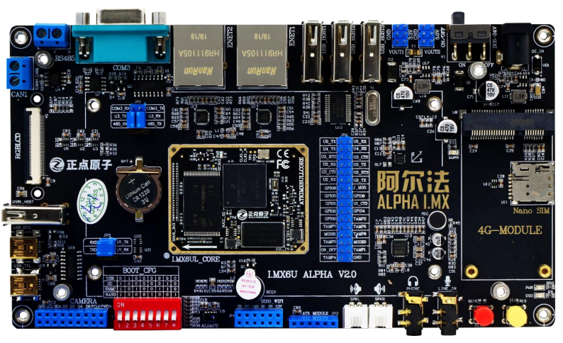

# 正点原子 I.MX6U ALPHA  开发板学习笔记



```
Something I hope you know before go into the coding~
First, please watch or star this repo, I'll be more happy if you follow me.
Bug report, questions and discussion are welcome, you can post an issue or pull a request.
```

## 相关站点

* GitHub 地址 : <https://github.com/yifengyou/learn-imx6u>
* GibBook 地址 : <https://yifengyou.gitbooks.io/learn-imx6u/content/>
* GibPage 地址 : <https://yifengyou.github.io/learn-imx6u>

## 目录

* [[第一期] Ubuntu入门](docs/ph1.md)
    * [开发电脑选择](docs/ph1/开发电脑选择.md)
    * [VMware软件安装和虚拟机创建](docs/ph1/VMware软件安装和虚拟机创建.md)
    * [VMware安装Ubuntu系统](docs/ph1/VMware安装Ubuntu系统.md)
    * [Ubuntu初次体验](docs/ph1/Ubuntu初次体验.md)
    * [虚拟机连接USB设备](docs/ph1/虚拟机连接USB设备.md)
    * [Ubuntu终端操作与Shell命令](docs/ph1/Ubuntu终端操作与Shell命令.md)
    * [Ubuntu软件安装](docs/ph1/Ubuntu软件安装.md)
    * [Ubuntu文件系统结构](docs/ph1/Ubuntu文件系统结构.md)
    * [Ubuntu下的磁盘管理](docs/ph1/Ubuntu下的磁盘管理.md)
* [[第二期] ARM（MX6U）裸机](docs/ph2.md)
    * [[第二期] ARM（MX6U）裸机](docs/ph2.md)
* [[第三期] 系统移植和跟文件系统构建](docs/ph3.md)
    * [[第三期] 系统移植和跟文件系统构建](docs/ph3.md)
* [[第四期] 驱动开发](docs/ph4.md)
    * [[第四期] 驱动开发](docs/ph4.md)


## 参考
