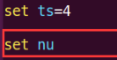
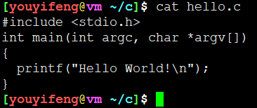
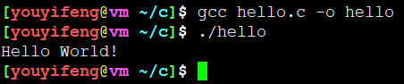
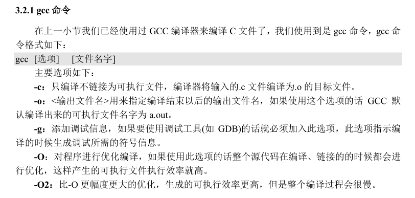
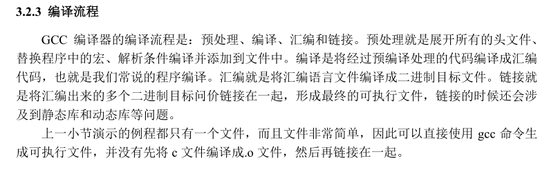

# Linux C编程

## 编辑器、编译器

* 编辑器用于源码文件编辑
  - 推荐vscode
* 编辑器用于编译源码
  - 常见gcc

## vim编辑器配置

```
vim ~/.vimrc
```



## 检测系统gcc

* Ubuntu默认自带gcc

```
gcc -v
```

## helloworld测试

```
#include <stdio.h>
int main(int argc, char *argv[])
{
  printf("Hello World!\n");
}
```






* -v : 显示详细编译过程

```
[youyifeng@vm ~/c]$ gcc -v hello.c -o hello
Using built-in specs.
COLLECT_GCC=gcc
COLLECT_LTO_WRAPPER=/usr/lib/gcc/x86_64-linux-gnu/7/lto-wrapper
OFFLOAD_TARGET_NAMES=nvptx-none
OFFLOAD_TARGET_DEFAULT=1
Target: x86_64-linux-gnu
Configured with: ../src/configure -v --with-pkgversion='Ubuntu 7.5.0-3ubuntu1~18.04' --with-bugurl=file:///usr/share/doc/gcc-7/README.Bugs --enable-languages=c,ada,c++,go,brig,d,fortran,objc,obj-c++ --prefix=/usr --with-gcc-major-version-only --program-suffix=-7 --program-prefix=x86_64-linux-gnu- --enable-shared --enable-linker-build-id --libexecdir=/usr/lib --without-included-gettext --enable-threads=posix --libdir=/usr/lib --enable-nls --enable-bootstrap --enable-clocale=gnu --enable-libstdcxx-debug --enable-libstdcxx-time=yes --with-default-libstdcxx-abi=new --enable-gnu-unique-object --disable-vtable-verify --enable-libmpx --enable-plugin --enable-default-pie --with-system-zlib --with-target-system-zlib --enable-objc-gc=auto --enable-multiarch --disable-werror --with-arch-32=i686 --with-abi=m64 --with-multilib-list=m32,m64,mx32 --enable-multilib --with-tune=generic --enable-offload-targets=nvptx-none --without-cuda-driver --enable-checking=release --build=x86_64-linux-gnu --host=x86_64-linux-gnu --target=x86_64-linux-gnu
Thread model: posix
gcc version 7.5.0 (Ubuntu 7.5.0-3ubuntu1~18.04)
COLLECT_GCC_OPTIONS='-v' '-o' 'hello' '-mtune=generic' '-march=x86-64'
 /usr/lib/gcc/x86_64-linux-gnu/7/cc1 -quiet -v -imultiarch x86_64-linux-gnu hello.c -quiet -dumpbase hello.c -mtune=generic -march=x86-64 -auxbase hello -version -fstack-protector-strong -Wformat -Wformat-security -o /tmp/ccAOXF5K.s
GNU C11 (Ubuntu 7.5.0-3ubuntu1~18.04) version 7.5.0 (x86_64-linux-gnu)
	compiled by GNU C version 7.5.0, GMP version 6.1.2, MPFR version 4.0.1, MPC version 1.1.0, isl version isl-0.19-GMP

GGC heuristics: --param ggc-min-expand=100 --param ggc-min-heapsize=131072
ignoring nonexistent directory "/usr/local/include/x86_64-linux-gnu"
ignoring nonexistent directory "/usr/lib/gcc/x86_64-linux-gnu/7/../../../../x86_64-linux-gnu/include"
#include "..." search starts here:
#include <...> search starts here:
 /usr/lib/gcc/x86_64-linux-gnu/7/include
 /usr/local/include
 /usr/lib/gcc/x86_64-linux-gnu/7/include-fixed
 /usr/include/x86_64-linux-gnu
 /usr/include
End of search list.
GNU C11 (Ubuntu 7.5.0-3ubuntu1~18.04) version 7.5.0 (x86_64-linux-gnu)
	compiled by GNU C version 7.5.0, GMP version 6.1.2, MPFR version 4.0.1, MPC version 1.1.0, isl version isl-0.19-GMP

GGC heuristics: --param ggc-min-expand=100 --param ggc-min-heapsize=131072
Compiler executable checksum: b62ed4a2880cd4159476ea8293b72fa8
COLLECT_GCC_OPTIONS='-v' '-o' 'hello' '-mtune=generic' '-march=x86-64'
 as -v --64 -o /tmp/cc8i4X2J.o /tmp/ccAOXF5K.s
GNU assembler version 2.30 (x86_64-linux-gnu) using BFD version (GNU Binutils for Ubuntu) 2.30
COMPILER_PATH=/usr/lib/gcc/x86_64-linux-gnu/7/:/usr/lib/gcc/x86_64-linux-gnu/7/:/usr/lib/gcc/x86_64-linux-gnu/:/usr/lib/gcc/x86_64-linux-gnu/7/:/usr/lib/gcc/x86_64-linux-gnu/
LIBRARY_PATH=/usr/lib/gcc/x86_64-linux-gnu/7/:/usr/lib/gcc/x86_64-linux-gnu/7/../../../x86_64-linux-gnu/:/usr/lib/gcc/x86_64-linux-gnu/7/../../../../lib/:/lib/x86_64-linux-gnu/:/lib/../lib/:/usr/lib/x86_64-linux-gnu/:/usr/lib/../lib/:/usr/lib/gcc/x86_64-linux-gnu/7/../../../:/lib/:/usr/lib/
COLLECT_GCC_OPTIONS='-v' '-o' 'hello' '-mtune=generic' '-march=x86-64'
 /usr/lib/gcc/x86_64-linux-gnu/7/collect2 -plugin /usr/lib/gcc/x86_64-linux-gnu/7/liblto_plugin.so -plugin-opt=/usr/lib/gcc/x86_64-linux-gnu/7/lto-wrapper -plugin-opt=-fresolution=/tmp/cc2NEG3I.res -plugin-opt=-pass-through=-lgcc -plugin-opt=-pass-through=-lgcc_s -plugin-opt=-pass-through=-lc -plugin-opt=-pass-through=-lgcc -plugin-opt=-pass-through=-lgcc_s --build-id --eh-frame-hdr -m elf_x86_64 --hash-style=gnu --as-needed -dynamic-linker /lib64/ld-linux-x86-64.so.2 -pie -z now -z relro -o hello /usr/lib/gcc/x86_64-linux-gnu/7/../../../x86_64-linux-gnu/Scrt1.o /usr/lib/gcc/x86_64-linux-gnu/7/../../../x86_64-linux-gnu/crti.o /usr/lib/gcc/x86_64-linux-gnu/7/crtbeginS.o -L/usr/lib/gcc/x86_64-linux-gnu/7 -L/usr/lib/gcc/x86_64-linux-gnu/7/../../../x86_64-linux-gnu -L/usr/lib/gcc/x86_64-linux-gnu/7/../../../../lib -L/lib/x86_64-linux-gnu -L/lib/../lib -L/usr/lib/x86_64-linux-gnu -L/usr/lib/../lib -L/usr/lib/gcc/x86_64-linux-gnu/7/../../.. /tmp/cc8i4X2J.o -lgcc --push-state --as-needed -lgcc_s --pop-state -lc -lgcc --push-state --as-needed -lgcc_s --pop-state /usr/lib/gcc/x86_64-linux-gnu/7/crtendS.o /usr/lib/gcc/x86_64-linux-gnu/7/../../../x86_64-linux-gnu/crtn.o
COLLECT_GCC_OPTIONS='-v' '-o' 'hello' '-mtune=generic' '-march=x86-64'
[youyifeng@vm ~/c]$
```

## gcc编译器



## 编译流程

 


---
