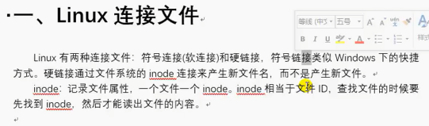
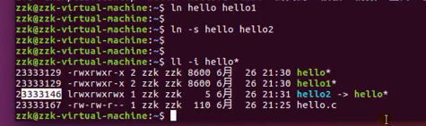
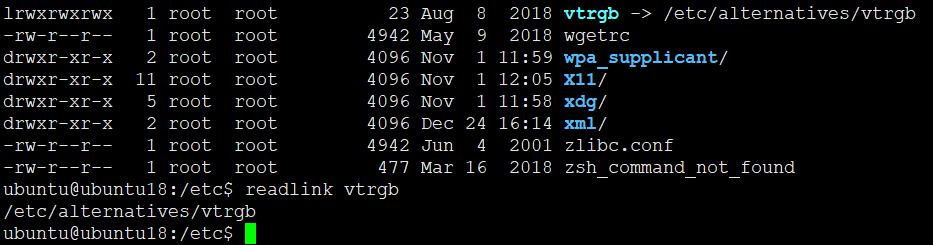
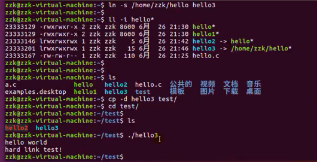
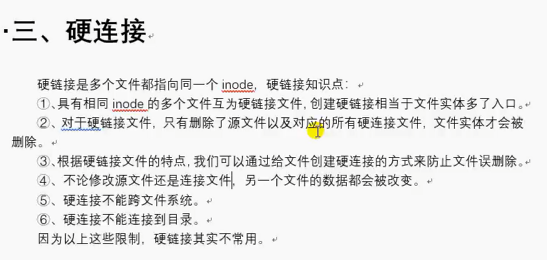
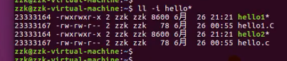

# Linux连接文件



## 软链接

* 类似windows下快捷方式
* 可以跨文件系统
* 可以链接到目录


```
ln -s FILE SOFTFILE
```



### 获取符号链接的绝对路径

* 使用readlink



### 软链接使用绝对路径

* 软链接一定要用绝对路径，避免错误





## 硬链接

* 文件node（文件元数据）相同，修改计数器
* 硬链接默认-1引用计数，如果为0才删除文件，否则仅仅修改引用计数
* 不能跨文件系统

```
ln FILE SOFTFILE
```






---
