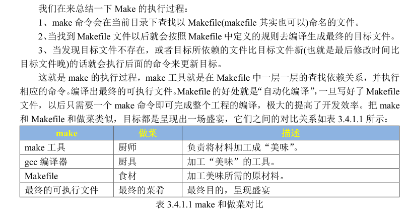

# Makefile基本语法

* 建议参看 reference/跟我一起写Makefile.pdf

## Makefile基本格式

## Makefile变量

## Makefile模式规则

## Makefile自动化变量

## Makefile伪目标

## Makefile条件判断

## Makefile函数使用

## Makefile执行流程

* 默认从第一个目标执行
* 从目标递归执行
* 根据依赖执行依赖生成命令

* 相比批处理，脚本，多了时间戳比较功能

---
