# Ubuntu下压缩与解压缩

## Linux下常用压缩格式

* tar
* tar.gz
* tar.bz2

## Windows下7zip压缩工具

* Windows默认支持的压缩格式少的可怜
* 常用的好压、360压缩
* <https://www.7-zip.org/>

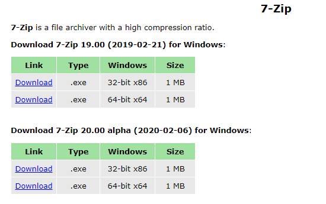

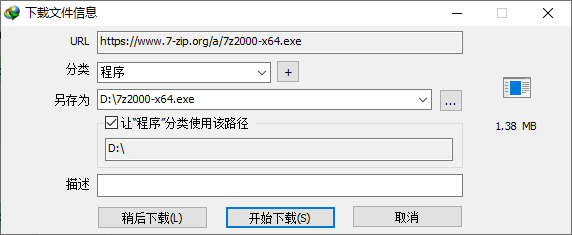

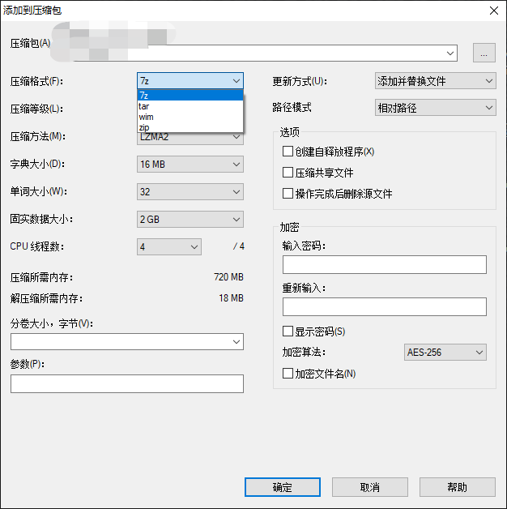

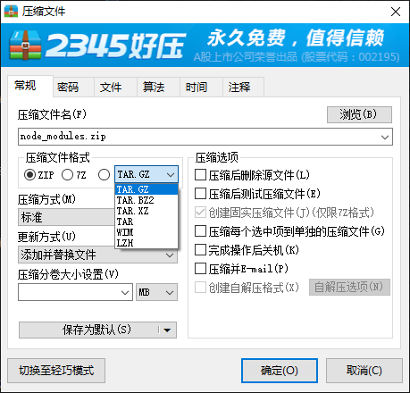

* 推荐好压，不推荐360压缩，不推荐7zip

## gzip压缩文件

**gzip不能针对整个目录进行压缩，只能递归压缩目录下的每一个文件**

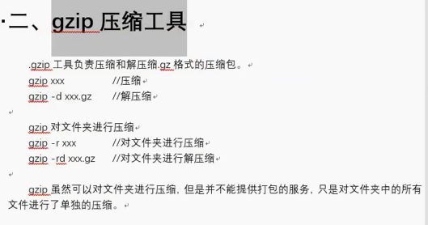

* gzip XXX ： 压缩。源文件直接删除，生成XXX.gz
* gzip -d XXX.gz : 解压缩。生成XXX，压缩包直接删除


* gzip -r 目录 ： 将目录下所有文件（不是文件夹），单独压缩成独立的压缩包


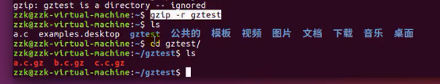

```
-k --keep
              Keep (don't delete) input files during compression or decompression.
```

* 注意一定要保留源文件！不要轻易删除，默认就是删除，比较危险

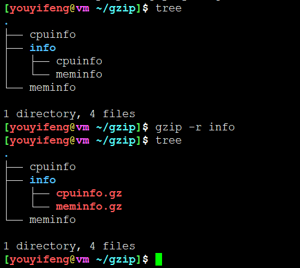

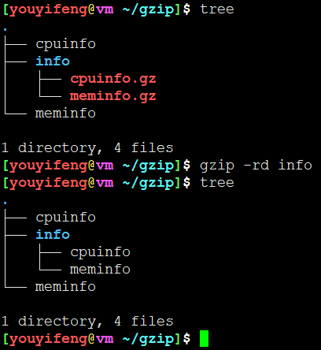

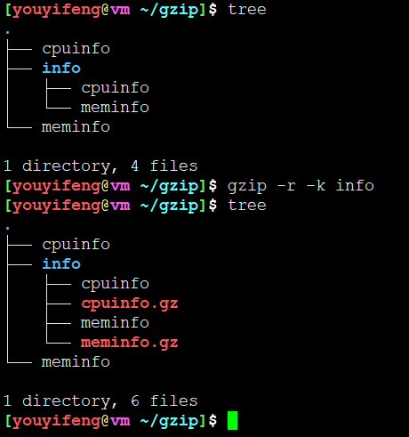


## bzip2压缩文件

**bzip2不能针对整个目录进行压缩，只针对单个文件操作**

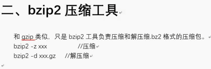


* bzip -z xxx : 压缩文件，删除源文件
* bzip -d xxx.bzip2 : 解压文件，删除源文件

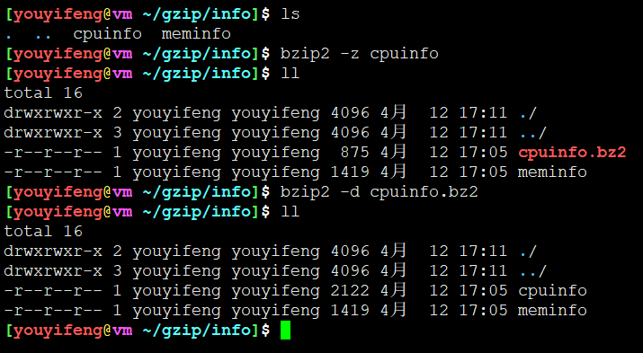


## tar打包文件

* gzip和bzip2都不能对目录进行整体打包压缩
* 常常借助tar进行打包后压缩

压缩：
```
tar -zcvf XXX.tar.gz xxx xxx xxx XXX
tar -jcvf xxx.tar.bz2 xxx xxx xxx xxxx
```

解压缩：
```
tar -zxvf XXX.tar.gz
tar -jxvf xxx.tar.bz2
```

常用选项
* -c ： 创建归档文件
* -x : 解包归档文件
* -f ： 指定输出

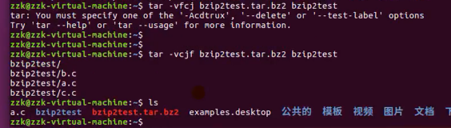

1. 对参数顺序有要求
2. 不会删除源文件

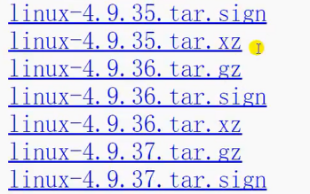

* 内核源码都是tar.gz 或者 tar.xz 压缩


## rar格式

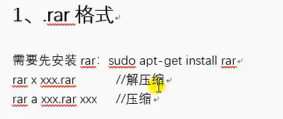

```
sudo apt-get install rar
```

1. rar x XXX.rar  ： 解压缩
2. rar a xxx.rar xxx : 压缩

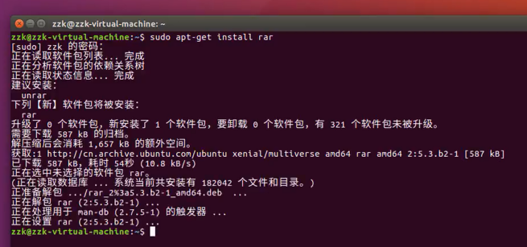

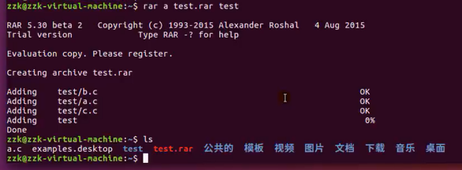

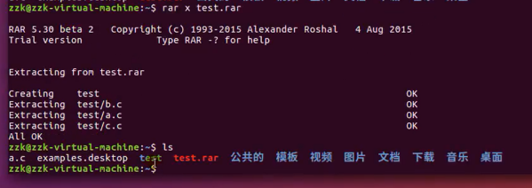

## zip格式

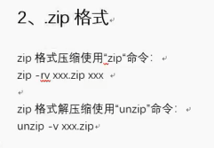

1. zip -rv xxx.zip  xxx1 xxx2 xxx3
2. unzip xxx.zip

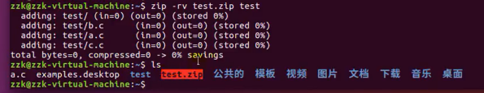

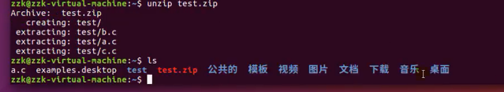

---
