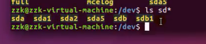
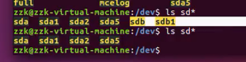
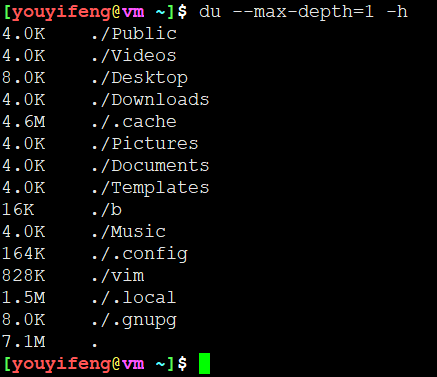
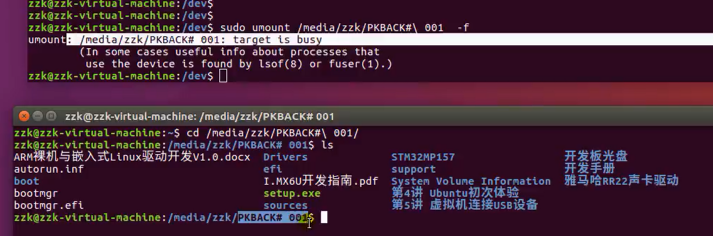
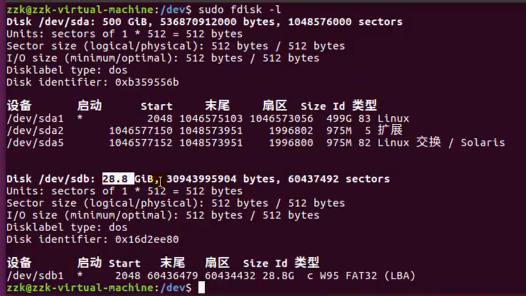
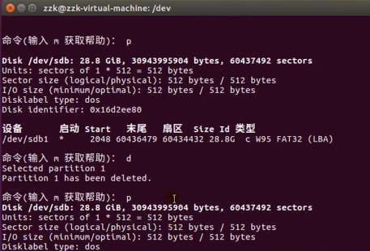
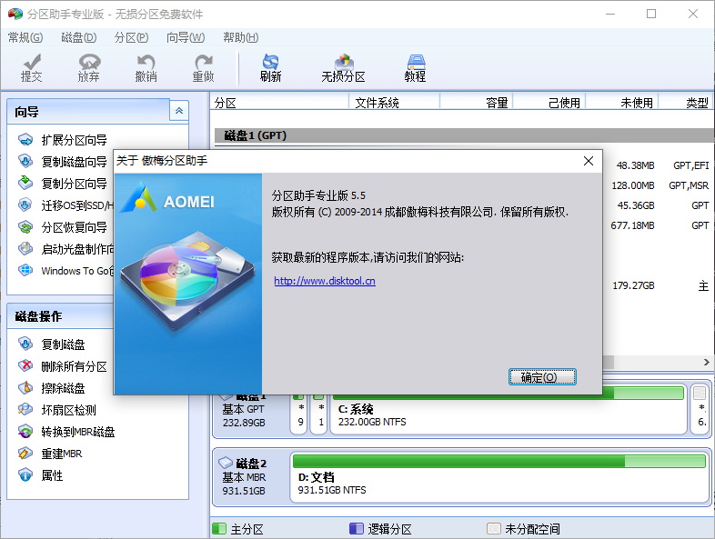
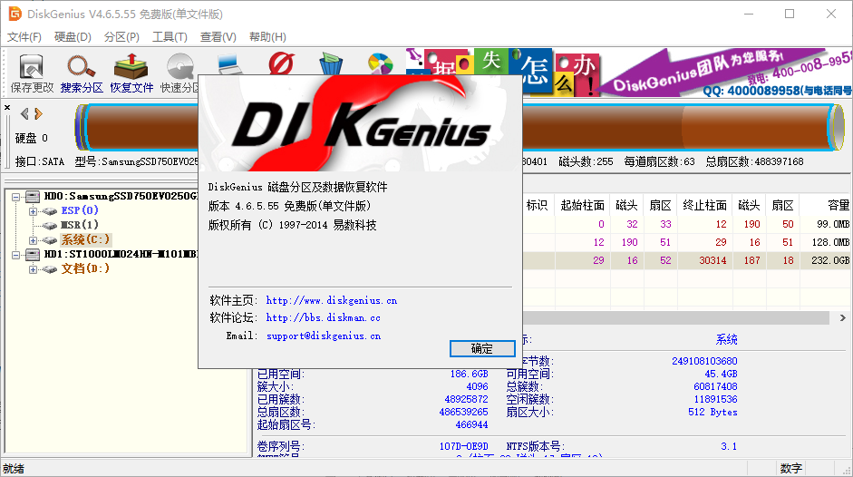
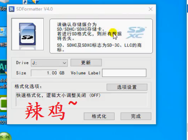

# Ubuntu下的磁盘管理

## 磁盘文件

* 一般SATA盘是/dev/sd开头
* [a-z]代表盘快，数字代表分区[0-3,5-N]



* 如何判断U盘是哪个设备文件，拔掉，消失的就是
* 也可以通过fidsk -l 查看所有分区，一般U盘是FAT或NTFS分区，Linux下是EXT系列分区



## 磁盘和目录容量查询

* du -sh 目录 : 查看目录大小
* df -h : 显示系统挂载点磁盘占用情况

* du --max-depth=1



## 磁盘挂载、卸载、分区和格式化

* mount 挂载 ,目标挂载点需要提前准备，必须为已存在目录


```
mount /dev/sd* /mnt
```

* umount 卸载，指定挂载点目录或者设备块文件即可
* 挂在卸载均需要root权限


* 如果挂载设备有文件占用，则无法卸载
* umount -lf ： lazy + 强制卸载



* 如果有终端工作路径为挂载点，则也无法卸载


* mount挂载中文乱码问题解决，通过-o指定iocharset

* fdisk磁盘分区工具
* fdisk需要root权限，不管是查看还是分区操作均要root权限




* fdisk -l : 查看系统分区信息
* fdisk /dev/sdb : 编辑sdb磁盘分区
* 如果设备处于挂载状态，则无法正常分区格式化。必须要卸载
* 其本质是修改磁盘块设备MBR中的分区表



* fdisk仅仅是分区，但是并没有格式化分区文件系统
* mkfs.ext4 /dev/sdb1 指定分区格式化为ext4
* mkfs.ext3
* mkfs.ext2
* mkfs.vfat


## Windows 下分区工具

* 建议傲梅分区助手、DiskGenius
* 佐神视频推荐的玩意儿就是辣鸡~








----
