# Ubuntu初次体验

## 开机体验

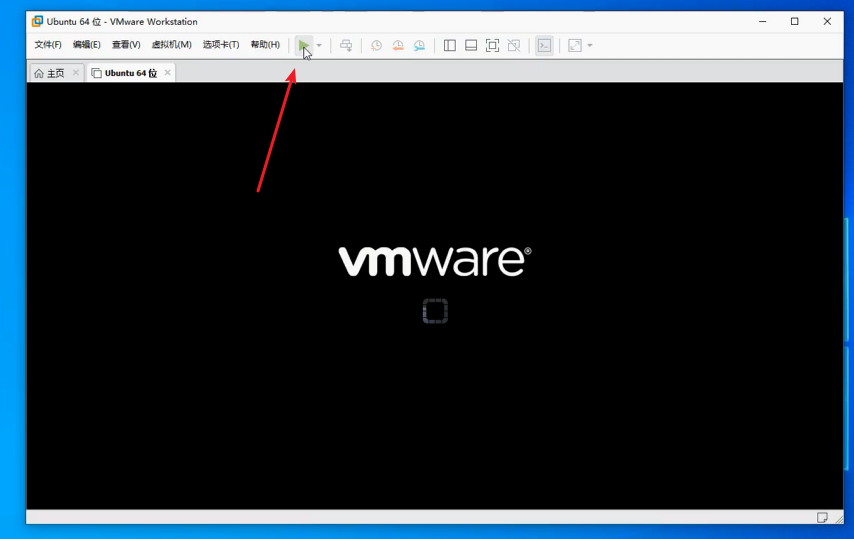

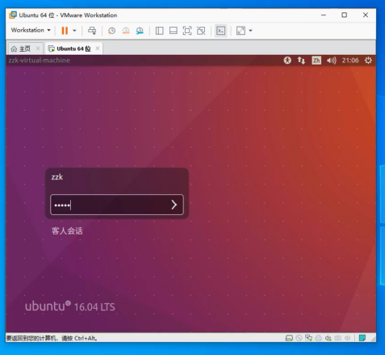

* Ubuntu对密码没有做过多安全限制，密码等级随意


## 设置桌面

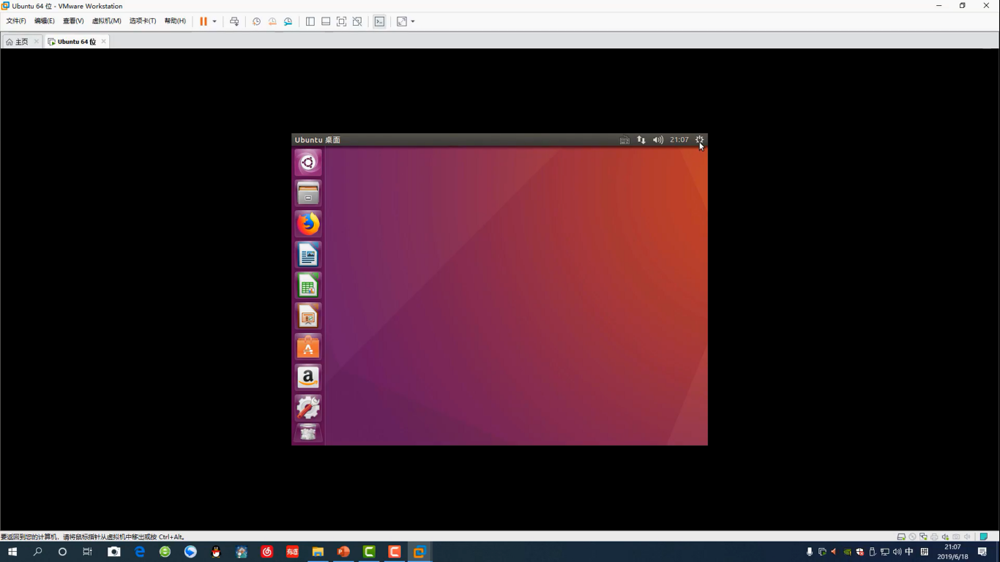

* 桌面太小怎么办
* 默认Ubunu分辨率为800*600

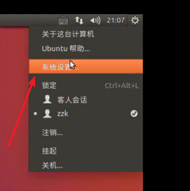

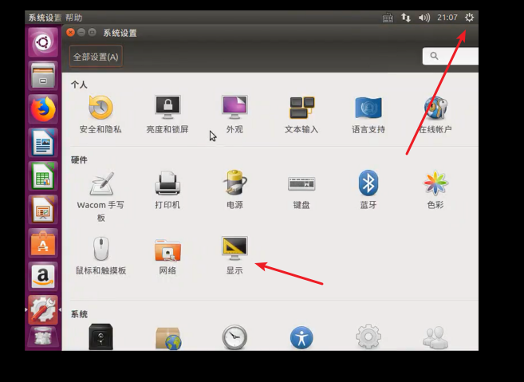

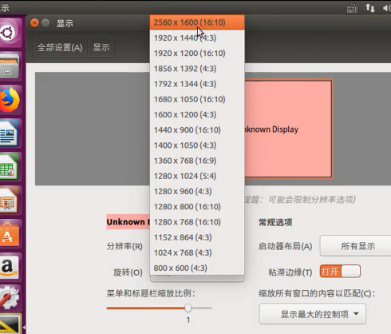

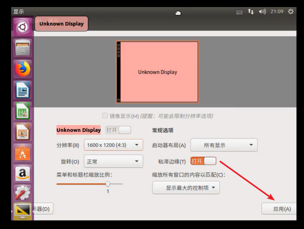

* 画面太小，无法显示完全
* 拖动上方窗口条，就可以左右移动，就能看到应用按钮了

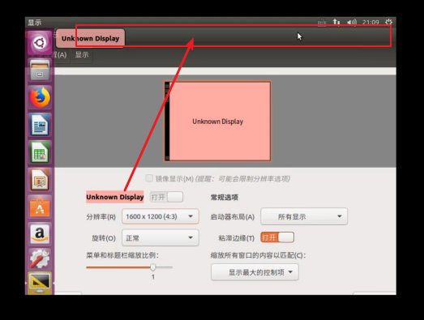


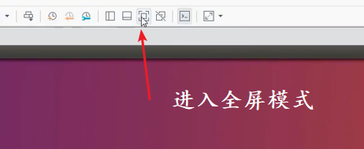

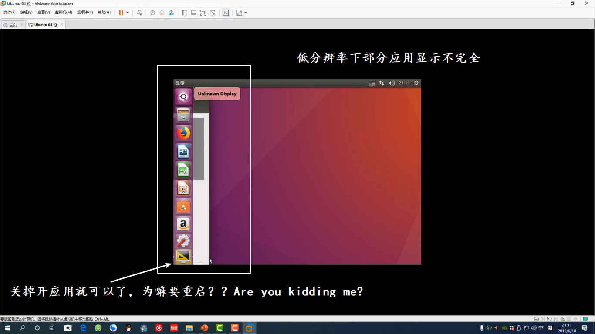

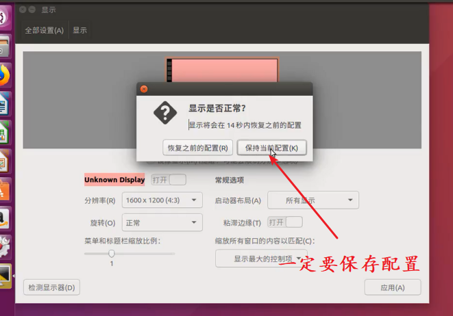

* 其实还是 Ubuntu 18.04 更好用
* 佐神对 Ubuntu系统还是不甚了解呢

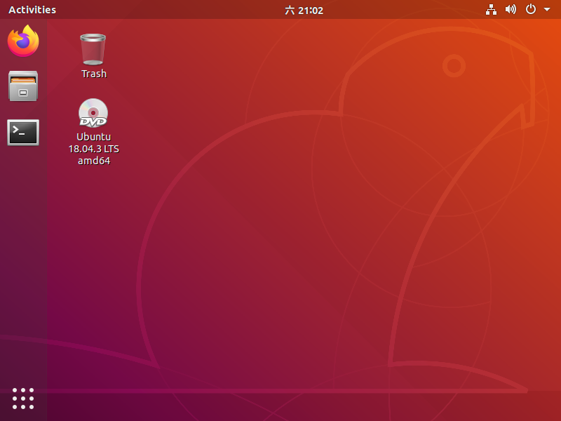

## Ubuntu 文件管理器

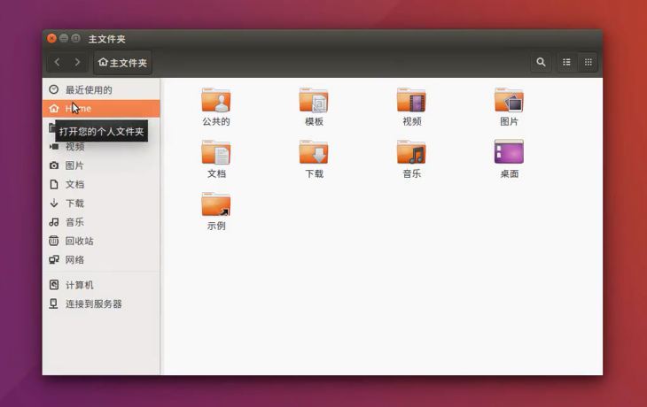

* 计算机里才是根分区显示
* 默认显示当前家目录文件

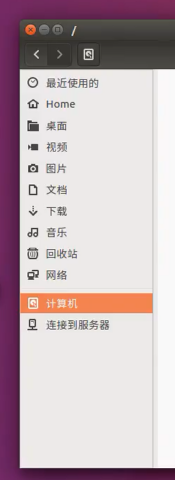

* Ubuntu下多分区，默认都是从根分区衍生，挂载在根分区某个节点下
* 目录树结构

## Ubuntu下火狐浏览器

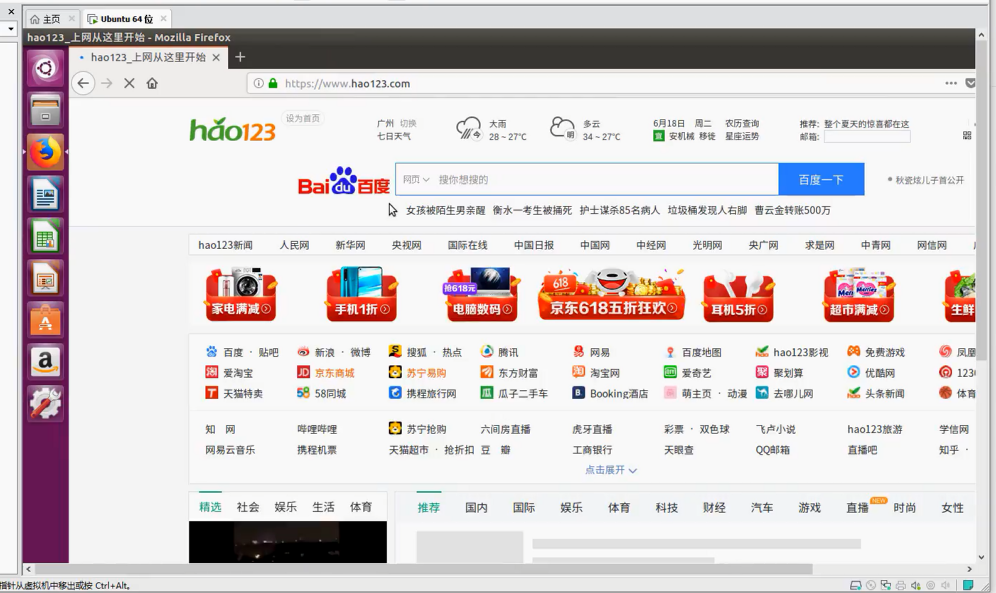

* 确保 Ubuntu 能够正常联网

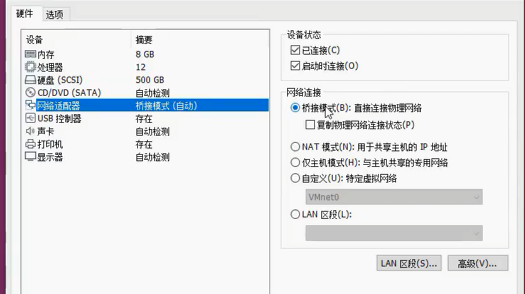

* 网络选择桥接，与当前局域网同一网段，局域网其他设备也能够访问到此虚拟机
* 开发板网路接到路由器上，与VMware虚拟机同处于一个LAN网段，可以相互访问（nfs、ftp)
* 如果选用NAT模式，相当于虚拟机处于子网段，虚拟机能访问外面，外面访问不到里面。LAN隔离


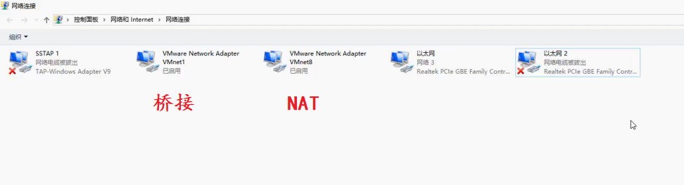

* Windows上可以看到VMware创建的虚拟网卡
* 禁用后是绝对不能上网的

## Ubuntu下的 “Word” 办公软件

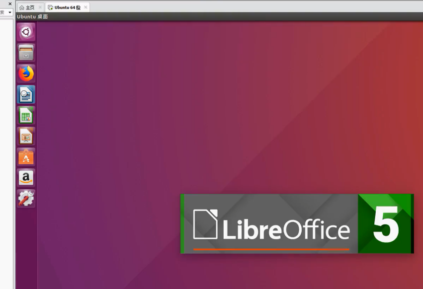

## Ubuntu下的应用商店

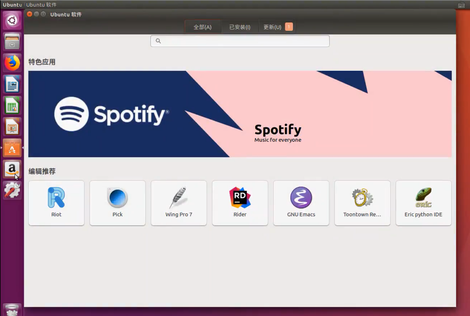

* 启动很慢，需要缓存
* 还不如命令终端下直接安装
* 好处就是会罗列一下你可能没接触过的软件

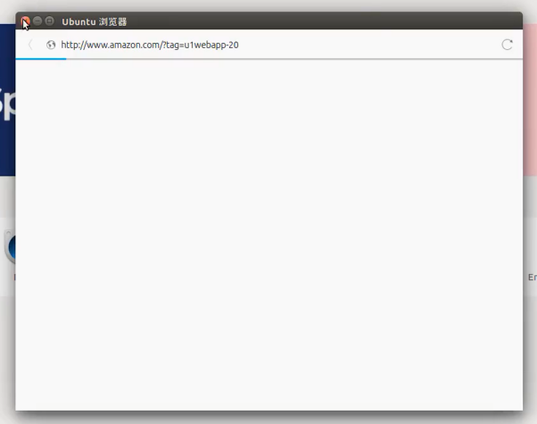

辣鸡亚马逊玷污Ubuntu、玷污Linux自由


## Ubuntu 系统设置

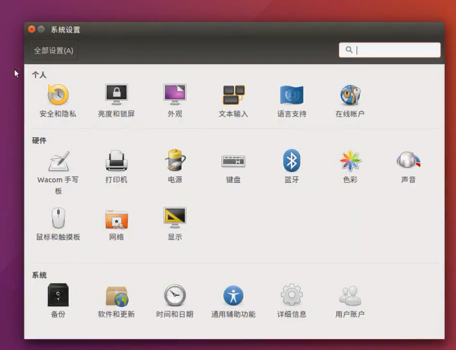

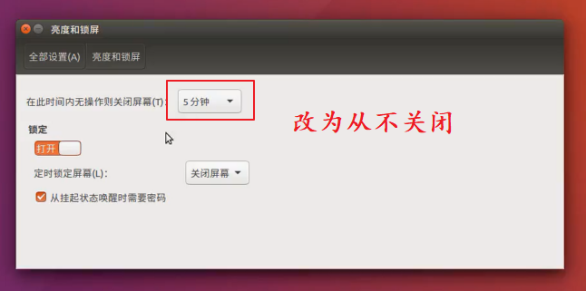

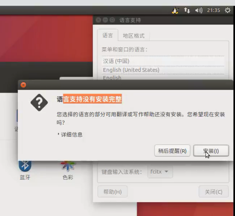

* 语言支持默认第一次启动都需要安装

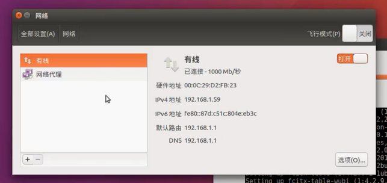

* 网络，如果有代理怎么办？

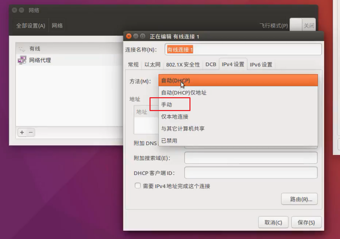

* 可以改成固定IP
* 改IP需要重启？？？Are you kidding me???


## Ubuntu 修改软件源

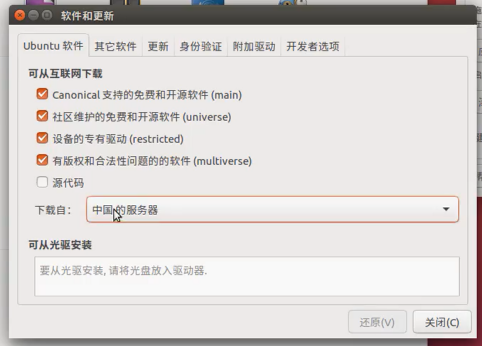

在系统设置中，默认中国服务器。然而，中国服务器还是用的Ubuntu家的中国服务器，比不上腾讯云，阿里云，163软件源

```
sudo vim /etc/apt/sources.list
```

修改这个文件，内容填充如下：

```
deb http://mirrors.aliyun.com/ubuntu/ bionic main restricted
deb http://mirrors.aliyun.com/ubuntu/ bionic-updates main restricted
deb http://mirrors.aliyun.com/ubuntu/ bionic universe
deb http://mirrors.aliyun.com/ubuntu/ bionic-updates universe
deb http://mirrors.aliyun.com/ubuntu/ bionic multiverse
deb http://mirrors.aliyun.com/ubuntu/ bionic-updates multiverse
deb http://mirrors.aliyun.com/ubuntu/ bionic-backports main restricted universe multiverse
```
之后,更新缓存

```
sudo apt-get update
```

然后，没有然后了


---
