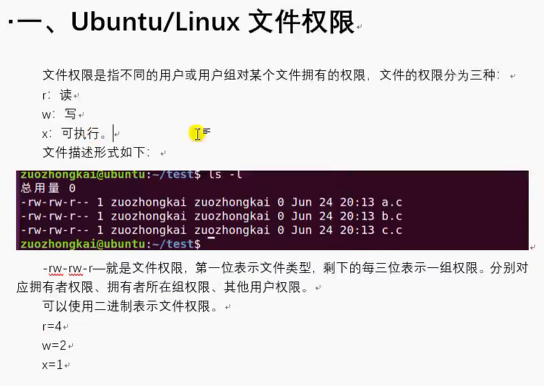
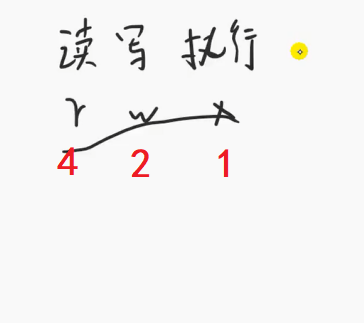
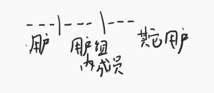
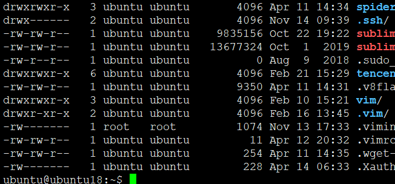
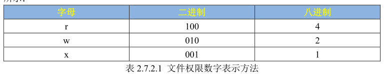
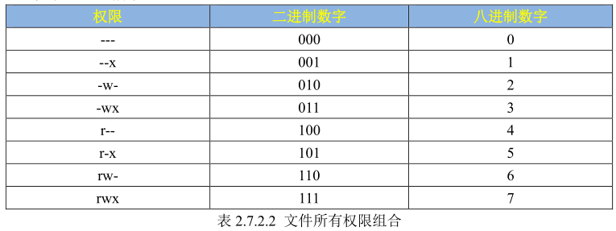
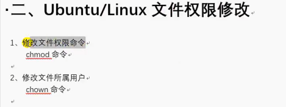
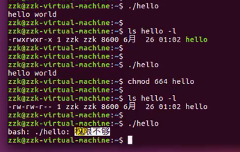

# Ubuntu文件权限管理

## linux文件权限





* 粘滞位（Stickybit），又称粘着位，是Unix文件系统权限的一个旗标。最常见的用法在目录上设置粘滞位，也只能针对⽬录设置，对于⽂件⽆效。则设置了粘滞位后，只有目录内文件的所有者或者root才可以删除或移动该文件。如果不为目录设置粘滞位，任何具有该目录写和执行权限的用户都可以删除和移动其中的文件。实际应用中，粘滞位一般用于/tmp目录，以防止普通用户删除或移动其他用户的文件。





* 常用权限755、644





## 文件权限修改



* 递归修改文件所属

```
chown -R yifengyou:yifengyou FILE
```

* 递归修改文件权限

```
chmod -R 644 ./*
```

 

---
