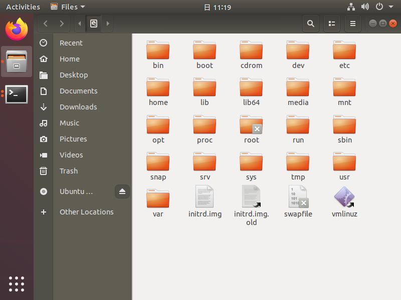
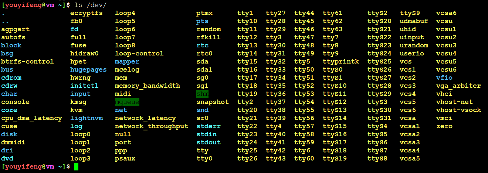
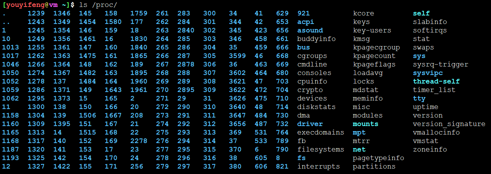
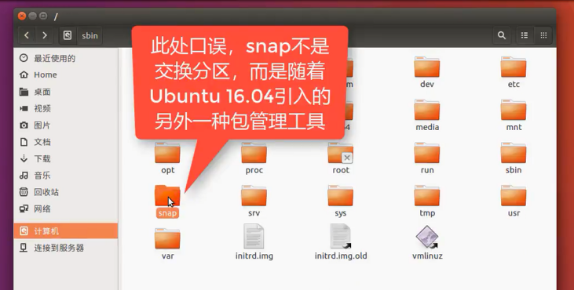
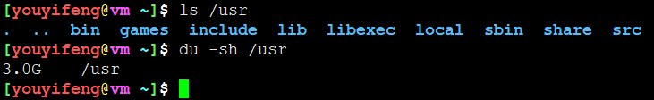

<!-- MDTOC maxdepth:6 firsth1:1 numbering:0 flatten:0 bullets:1 updateOnSave:1 -->

- [Ubuntu文件系统结构](#ubuntu文件系统结构)   
   - [基本理论](#基本理论)   
   - [详解文件系统各个目录作用](#详解文件系统各个目录作用)   
   - [dev目录](#dev目录)   
   - [etc 目录](#etc-目录)   
   - [proc目录](#proc目录)   
   - [snap目录](#snap目录)   
   - [sys目录](#sys目录)   
   - [usr目录](#usr目录)   
   - [绝对路径和相对路径](#绝对路径和相对路径)   

<!-- /MDTOC -->
# Ubuntu文件系统结构

## 基本理论

* Linux文件系统，目录树结构，所有文件均从根路径出发



## 详解文件系统各个目录作用

```
/bin: bin是Binary的缩写。存放系统中最常用的可执行文件（二进制）。

/boot: 这里存放的是linux内核和系统启动文件，包括Grub、lilo启动器程序。

/dev: dev是Device(设备)的缩写。该目录存放的是Linux的外部设备，如硬盘、分区、键盘、鼠标、usb等。

/etc: 这个目录用来存放所有的系统管理所需要的配置文件和子目录，如passwd、hostname等。

/home: 用户的主目录，在Linux中，每个用户都有一个自己的目录，一般该目录名是以用户的账号命名的。

/lib: 存放共享的库文件，包含许多被/bin和/sbin中程序使用的库文件。

/lost+found: 这个目录一般情况下是空的，当系统非法关机后，这里就存放了一些零散文件。

/media: ubuntu系统自动挂载的光驱、usb设备，存放临时读入的文件。/media/${USER}/ 下才是具体挂载设备

/mnt: 作为被挂载的文件系统得挂载点。

/opt: 作为可选文件和程序的存放目录，主要被第三方开发者用来简易安装和卸载他们的软件。

/proc: 这个目录是一个虚拟的目录，它是系统内存的映射，我们可以通过直接访问这个目录来获取系统信息。这里存放所有标志为文件的进程，比较cpuinfo存放cpu当前工作状态的数据。

/root: 该目录为系统管理员，也称作超级权限者的用户主目录。

/sbin: s就是Super User的意思，这里存放的是系统管理员使用的系统管理程序，如系统管理、目录查询等关键命令文件。

/srv: 存放系统所提供的服务数据。

/sys: 系统设备和文件层次结构，并向用户程序提供详细的内核数据信息。

/tmp: 这个目录是用来存放一些临时文件的，所有用户对此目录都有读写权限。

/usr: 存放与系统用户有关的文件和目录。

/usr 目录具体来说：

/usr/X11R6: 存放X-Windows的目录；

/usr/games: 存放着XteamLinux自带的小游戏；

/usr/bin: 用户和管理员的标准命令；

/usr/sbin: 存放root超级用户使用的管理程序；

/usr/doc: Linux技术文档；

/usr/include: 用来存放Linux下开发和编译应用程序所需要的头文件，for c 或者c++；

/usr/lib: 应用程序和程序包的连接库；

/usr/local: 系统管理员安装的应用程序目录；

/usr/man: 帮助文档所在的目录；

/usr/src: Linux开放的源代码；

/var: 长度可变的文件，尤其是些记录数据，如日志文件和打印机文件。

/var/cache: 应用程序缓存目录；

/var/crash: 系统错误信息；

/var/games: 游戏数据；

/var/log: 日志文件；

/var/mail: 电子邮件；

/var/tmp: 临时文件目录；
```

## dev目录



## etc 目录

```
[youyifeng@vm ~]$ ls /etc
.                       dhcp                 kernel               newt                     selinux
..                      dictionaries-common  kernel-img.conf      nsswitch.conf            sensors3.conf
acpi                    dpkg                 kerneloops.conf      opt                      sensors.d
adduser.conf            emacs                ldap                 os-release               services
alternatives            environment          ld.so.cache          PackageKit               shadow
anacrontab              firefox              ld.so.conf           pam.conf                 shadow-
apache2                 fonts                ld.so.conf.d         pam.d                    shells
apg.conf                fstab                legal                papersize                skel
apm                     fuse.conf            libao.conf           passwd                   speech-dispatcher
apparmor                fwupd                libaudit.conf        passwd-                  ssh
apparmor.d              gai.conf             libblockdev          pcmcia                   ssl
apport                  gdb                  libnl-3              perl                     subgid
appstream.conf          gdm3                 libpaper.d           pki                      subgid-
apt                     geoclue              libreoffice          pm                       subuid
avahi                   ghostscript          lighttpd             pnm2ppa.conf             subuid-
bash.bashrc             glances              lintianrc            polkit-1                 sudoers
bash_completion         glvnd                locale.alias         popularity-contest.conf  sudoers.d
bash_completion.d       gnome                locale.gen           ppp                      sysctl.conf
bindresvport.blacklist  groff                localtime            printcap                 sysctl.d
binfmt.d                group                logcheck             profile                  systemd
bluetooth               group-               login.defs           profile.d                terminfo
brlapi.key              grub.d               logrotate.conf       protocols                thermald
brltty                  gshadow              logrotate.d          pulse                    thunderbird
brltty.conf             gshadow-             lsb-release          .pwd.lock                timezone
ca-certificates         gss                  ltrace.conf          python                   tmpfiles.d
ca-certificates.conf    gtk-2.0              machine-id           python2.7                ucf.conf
calendar                gtk-3.0              magic                python3                  udev
chatscripts             hddtemp.db           magic.mime           python3.6                udisks2
console-setup           hdparm.conf          mailcap              rc0.d                    ufw
cracklib                host.conf            mailcap.order        rc1.d                    updatedb.conf
cron.d                  hostname             manpath.config       rc2.d                    update-manager
cron.daily              hosts                matplotlibrc         rc3.d                    update-motd.d
cron.hourly             hosts.allow          mime.types           rc4.d                    update-notifier
cron.monthly            hosts.deny           mke2fs.conf          rc5.d                    UPower
crontab                 hp                   modprobe.d           rc6.d                    usb_modeswitch.conf
cron.weekly             ifplugd              modules              rcS.d                    usb_modeswitch.d
cups                    ImageMagick-6        modules-load.d       resolvconf               vim
cupshelpers             init                 mtab                 resolv.conf              vtrgb
dbus-1                  init.d               mtools.conf          rmt                      wgetrc
dconf                   initramfs-tools      nanorc               rpc                      wpa_supplicant
debconf.conf            inputrc              netplan              rsyslog.conf             X11
debian_version          insserv.conf.d       network              rsyslog.d                xdg
default                 iproute2             networkd-dispatcher  sane.d                   zsh_command_not_found
deluser.conf            issue                NetworkManager       securetty
depmod.d                issue.net            networks             security
```


## proc目录




* 每个数字目录均为进程PID


## snap目录



## sys目录


## usr目录



## 绝对路径和相对路径

* pwd为当前工作路径
* 相对于pwd的路径就是相对路径
* 相对于根/的路径就是绝对路径

 


---


---
