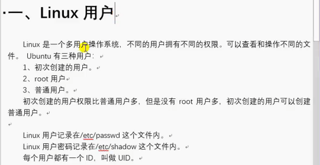
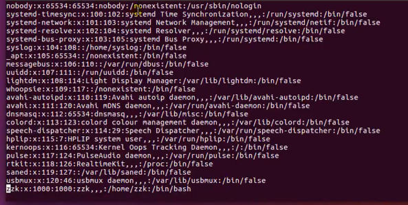
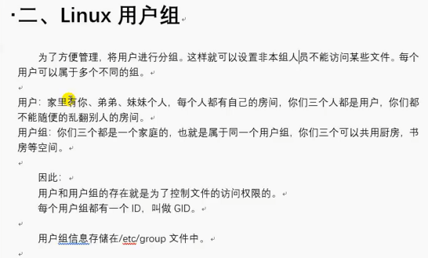
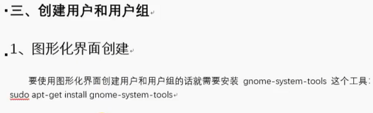
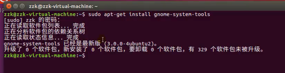
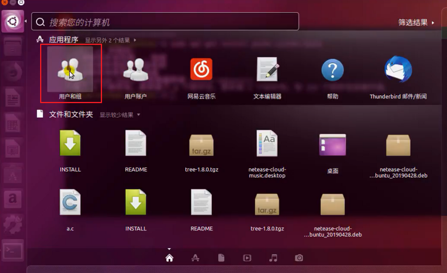
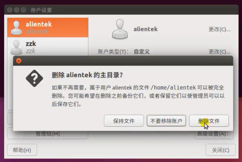
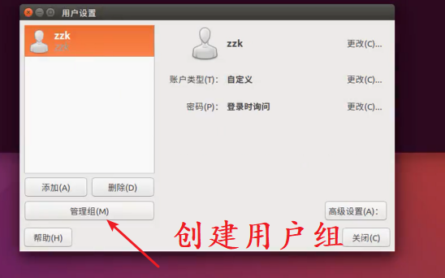
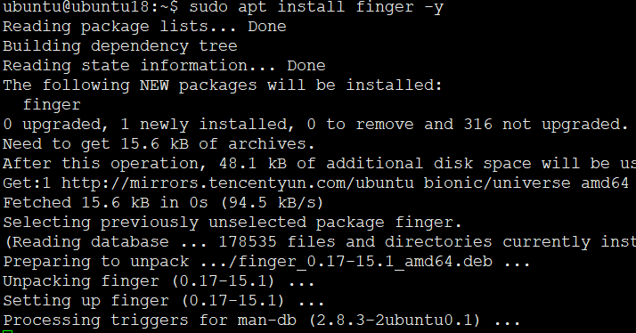
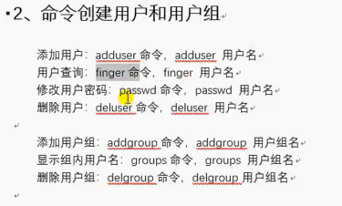

<!-- MDTOC maxdepth:6 firsth1:1 numbering:0 flatten:0 bullets:1 updateOnSave:1 -->

- [Ubuntu用户与用户组](#ubuntu用户与用户组)   
   - [用户](#用户)   
   - [用户组](#用户组)   
   - [创建用户组](#创建用户组)   
      - [通过图形界面管理用户及用户组(禁用)](#通过图形界面管理用户及用户组禁用)   
      - [命令行管理用户及用户组](#命令行管理用户及用户组)   

<!-- /MDTOC -->
# Ubuntu用户与用户组

## 用户





* 普通用户 （UID 500-60000）
* 伪（系统）用户（UID 1-499）
* root (UID = 0)
* /etc/passwd /etc/shadow

* 想要创建用户，不用sudo？？？怎么想的
* 凡是操作非本组，分本用户的账户管理内容均需要sudo


## 用户组



* 物以类聚，人以群分
* 分组管理
* 用户组存储在/etc/group


## 创建用户组

### 通过图形界面管理用户及用户组(禁用)



* 图形界面安装需要额外软件
* 傻瓜操作，使用图形界面能学到个锤子~

```
sudo apt-get install gnome-system-tools
```









### 命令行管理用户及用户组

```
sudo adduser yifengyou
```







---
