<!-- MDTOC maxdepth:6 firsth1:1 numbering:0 flatten:0 bullets:1 updateOnSave:1 -->

- [Ubuntu终端操作与Shell命令](#ubuntu终端操作与shell命令)   
   - [打开终端](#打开终端)   
   - [配置PS1变量](#配置ps1变量)   
   - [ls命令](#ls命令)   
      - [ls命令仅列出目录](#ls命令仅列出目录)   
   - [cd、pwd命令](#cd、pwd命令)   
   - [uname命令](#uname命令)   
   - [clear命令](#clear命令)   
   - [cat命令](#cat命令)   
   - [sudo命令](#sudo命令)   
   - [su命令](#su命令)   
   - [touch命令](#touch命令)   
   - [cp命令](#cp命令)   
   - [rm命令](#rm命令)   
   - [mkdir创建目录](#mkdir创建目录)   
   - [rmdir命令](#rmdir命令)   
   - [mv命令](#mv命令)   
   - [ifconfig命令](#ifconfig命令)   
   - [man命令](#man命令)   
   - [poweroff命令](#poweroff命令)   
   - [sync命令](#sync命令)   
   - [find命令](#find命令)   
   - [grep命令](#grep命令)   
   - [du命令](#du命令)   
   - [df命令](#df命令)   
   - [gedit软件](#gedit软件)   
   - [ps命令](#ps命令)   
   - [top命令](#top命令)   
   - [file命令](#file命令)   

<!-- /MDTOC -->
# Ubuntu终端操作与Shell命令

## 打开终端

* 桌面右击，open terminal

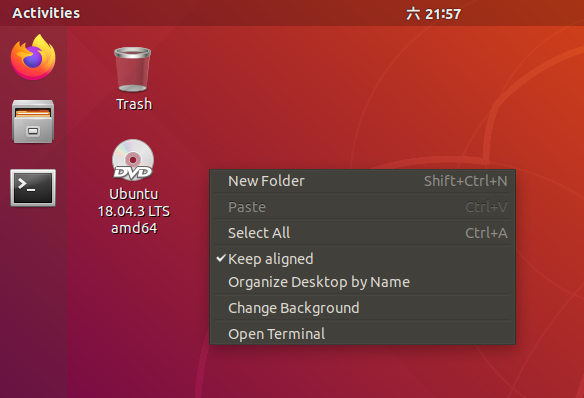


## 配置PS1变量

* PS1变量用于终端显示中的命令行前缀

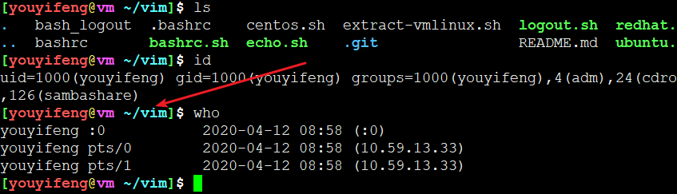

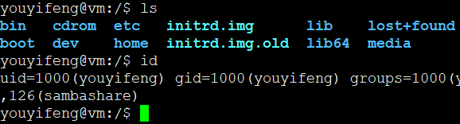

* 配置PS1变量，个性化前缀显示（带颜色），在终端中可以快速定位命令位置，命令前缀不会与命令内容混杂在一起。一眼看到命令前缀

```
vim ~/.bashrc
```

添加配置：
```
PS1='\[\e[32;1m\][\[\e[31;40m\]\u\[\e[33;40m\]@\[\e[35;40m\]\h\[\e[36;40m\] \w\[\e[32;1m\]]\[\e[37;1m\]\$\[\e[0m\] '
```

使配置生效需要source一下

```
source ~/.bashrc
```


## ls命令

* -a : 显示所有，包括隐藏文件/目录
* -l ： 列表形式输出，显示完整信息。不包括隐藏文件/目录
* -h ： 友好输出，转换文件大小为KB、MB、GB

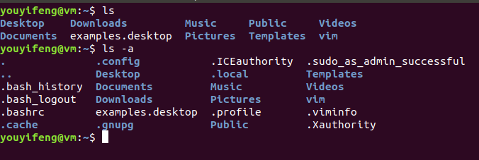

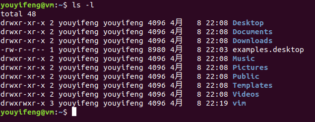

* ~代表HOME目录，不同用户HOME目录不同

### ls命令仅列出目录

```
ls -d */
```

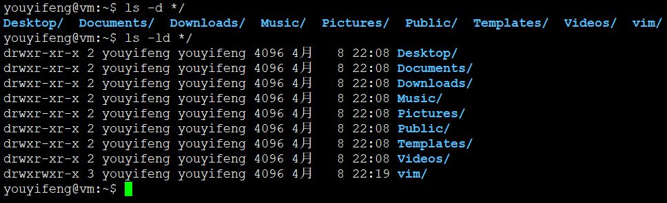

```
ls -l |grep "^d"
```

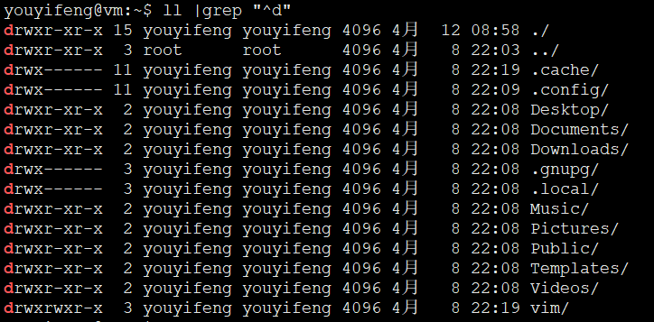

## cd、pwd命令

* 默认cd不加参数，进入家目录
* pwd查看当前工作目录


* TAB按键自动补全。罗列可选
* 自动补全，Ubuntu下安装 bash-completion ，缺少该包就无法自动补全

## uname命令


```
  -a, --all                print all information, in the following order,
                             except omit -p and -i if unknown:
  -s, --kernel-name        print the kernel name
  -n, --nodename           print the network node hostname
  -r, --kernel-release     print the kernel release
  -v, --kernel-version     print the kernel version
  -m, --machine            print the machine hardware name
  -p, --processor          print the processor type (non-portable)
  -i, --hardware-platform  print the hardware platform (non-portable)
  -o, --operating-system   print the operating system
      --help     display this help and exit
      --version  output version information and exit
```

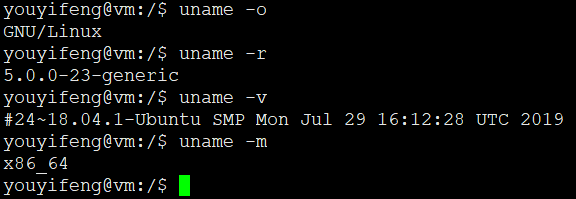

* 蛮多不需要记，只需要记住哪个命令，怎么用，help一下，再进行下一步


## clear命令

* 清除屏幕
* 内容仅仅上移，假清屏

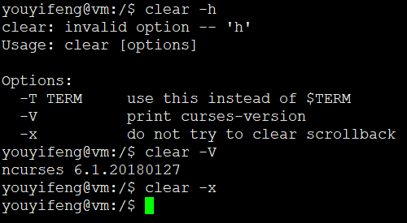


## cat命令

* 完全显示文件内容
* 如果是大文件，不建议用cat，用more显示部分

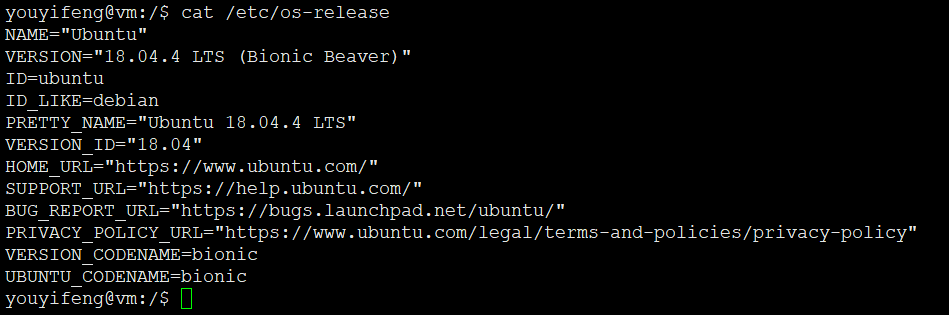

## sudo命令

* 使用root权限执行后面的命令
* 如果有代理，请注意配置/etc/sudoers ,添加代理的环境变量跟随，不然sudo后的命令不会继承当前环境下的代理变量（http_proxy,https_proxy,no_proxy都不会继承）
* sudo命令在第一次输入密码后，一段时间内不用在输入密码

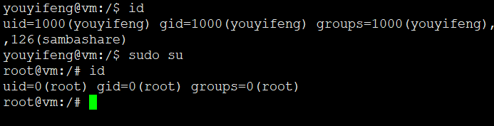

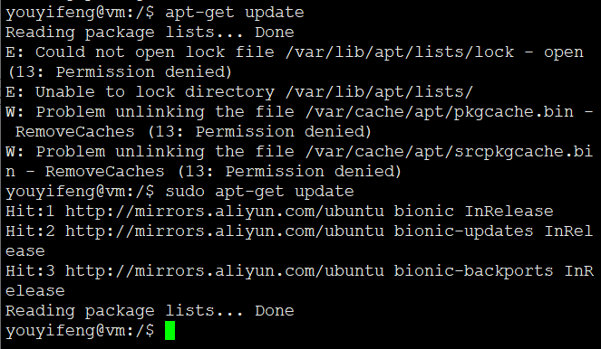

* sudo不是所有用户都可以用，默认为管理员用户，Ubuntu系统安装的时候指定的用户就可以用sudo
* 你自己再创建一个用户就用不了，不在管理员组。加入管理员组，或者修改/etc/sudoers添加该用户，也可以
* sudo su 指的是当前授权sudo用户，用当前用户密码进行授权，授权后就是root权限，用root权限执行su命令（switch user)..说白了，就是用当前用户的密码，切换到root用户。而不是用root账户的密码切换到root账户。
* 这样做的好处就是，你不需要直接透露root密码，用你的密码也能切换/操作/执行root

## su命令

* su纯粹切换用户（switch user)
* su后不加用户名默认为root，否则必须指定已经存在的用户，不然没意义呃

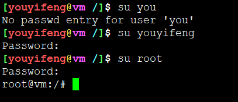

* 佐神视频里面讲的纯粹犯傻。。Ubuntu装机完成后默认root密码随机，必须要切换到root之后通过passwd命令进行修改。这是Ubuntu系统一直不变的尿性

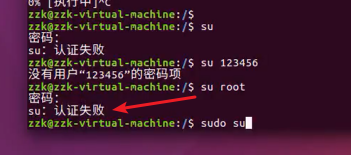

* root权限下执行su命令，后可以跟任意已存在用户，但是不需要密码

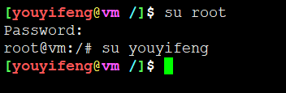


## touch命令

* touch 摸一下，摸一下文件就有了
* 摸一下，文件的元数据有了，但是没有具体数据


```
  -a                     change only the access time
  -c, --no-create        do not create any files
  -d, --date=STRING      parse STRING and use it instead of current time
  -f                     (ignored)
  -h, --no-dereference   affect each symbolic link instead of any referenced
                         file (useful only on systems that can change the
                         timestamps of a symlink)
  -m                     change only the modification time
  -r, --reference=FILE   use this file's times instead of current time
  -t STAMP               use [[CC]YY]MMDDhhmm[.ss] instead of current time
      --time=WORD        change the specified time:
                           WORD is access, atime, or use: equivalent to -a
                           WORD is modify or mtime: equivalent to -m
      --help     display this help and exit
      --version  output version information and exit
```

* 一般很少用到touch的选项
* touch更常用语更新文件的时间戳，摸一下，说明文件被访问了

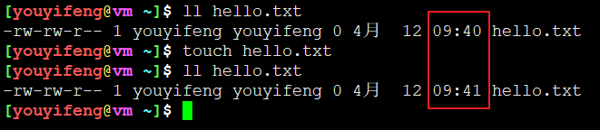


## cp命令

* cp是copy的简写
* cp不是网络流行语

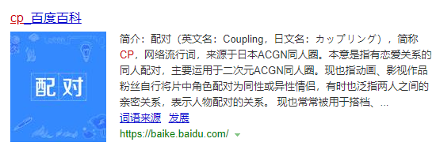


* cp无法直接拷贝目录，需要添加-a参数或-r参数

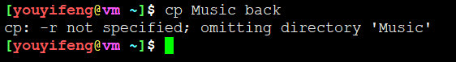


## rm命令

* 不能直接（不加参数）用于删除目录
* 常用选项 强制删除 + 递归删除

```
 -f, --force
              ignore nonexistent files and arguments, never prompt
 -r, -R, --recursive
              remove directories and their contents recursively
```

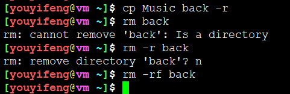

## mkdir创建目录

* 多级目录需要添加-p参数


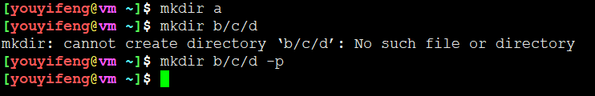


## rmdir命令

* 默认目录为空才能删除
* 仅能删除目录，目录中存在文件则无法删除
* rm强于rmdir，rm可以删除任意文件目录，递归强制不提醒删除
* rm更危险，使用要小心
* ```rm -rf /```一直是删库跑路的梗


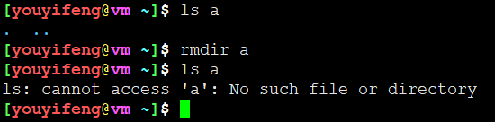

## mv命令

* move命令，用于重命名。重命名文件或目录

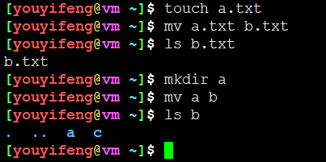

* 用于移动文件


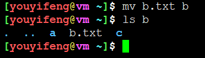

## ifconfig命令

* 不加参数默认显示已启用网卡信息


* -a参数显示所有网卡，包括未启用的
* 配置IP地址

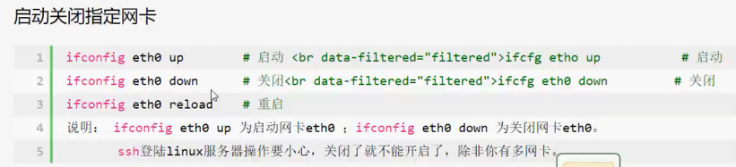

* 网卡启用、关闭操作需要root权限，sudo执行即可

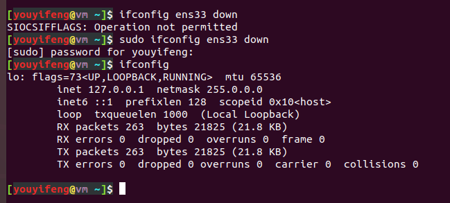

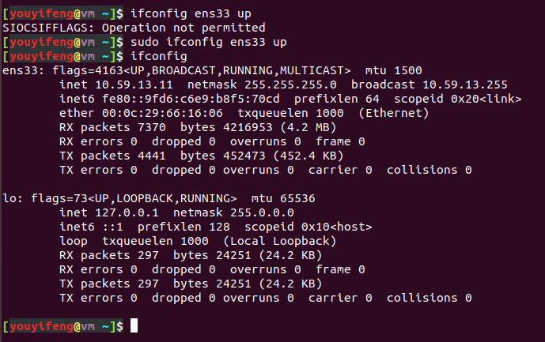

* 修改物理地址

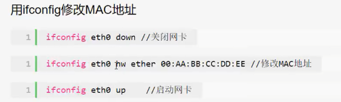

* 修改IP地址，首先检测ip是否被占用


```
sudo  ifconfig ens33 10.59.13.99
```

## man命令

* 查看命令/函数帮助信息
* 按q退出man帮助页


查看man命令帮助信息：

```
man man
```

## poweroff命令

* 关机命令,不需要root权限
* 也可sudo halt -p
* 也可sudo systemctl shutdown

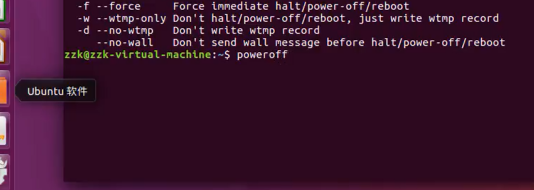

## sync命令

* 磁盘缓冲区数据写入磁盘
* 默认写磁盘内容优先写磁盘缓存，并没有真正写入磁盘
* sync强制写入

## find命令

* 文件/目录查找（匹配查找）
* 根据文件名查找
* 查找最近修改的文件
* 查找最近访问的文件


```
find  / -name "youyifeng.*"
```

## grep命令

* 文件内容搜索
* 常用：递归搜索当前目录下（包括子目录）所有文件包含的字符，全局搜索
* 也可匹配二进制文件
* 根据文件内容而不是文件名、目录名来查找

```
grep -rn "youyifeng"
```


* -i ： 忽略大消写
* -r ： 递归
* -n ： 显示行号

## du命令

* 统计大小，文件大小、文件夹大小

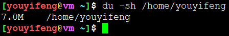

* -h : 人类可读方式
* -s ： 显示目录整体大小，不显示具体文件

## df命令

* 查看系统挂载点

```
report file system disk space usage
```

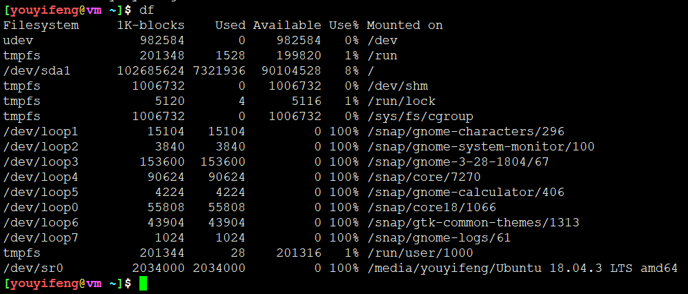


## gedit软件

* 文本编辑器

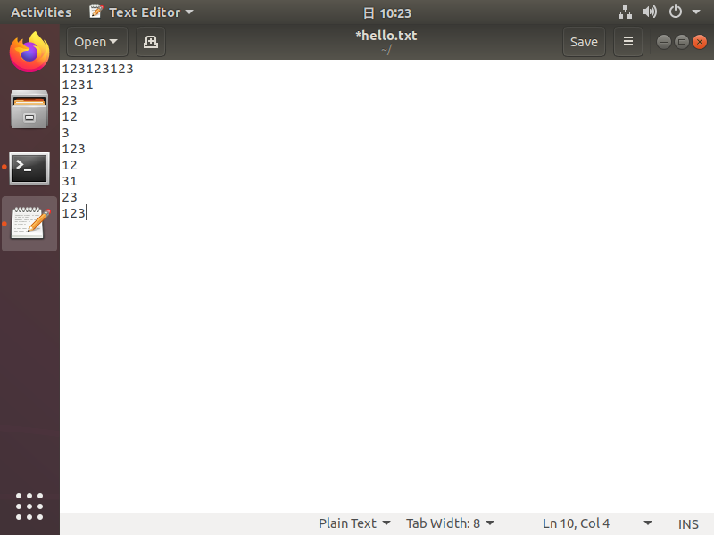

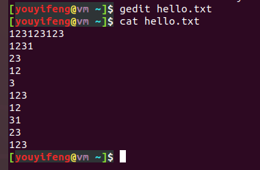

## ps命令

* 进程查看
* 嵌入式下ps为busybox，与Ubuntu不同
* 一般嵌入式（busybox）下直接ps就能显示所有

```
ps aux
```

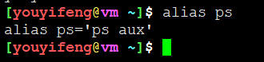


## top命令

* linux下的任务管理器
* 动态显示
* q命令退出

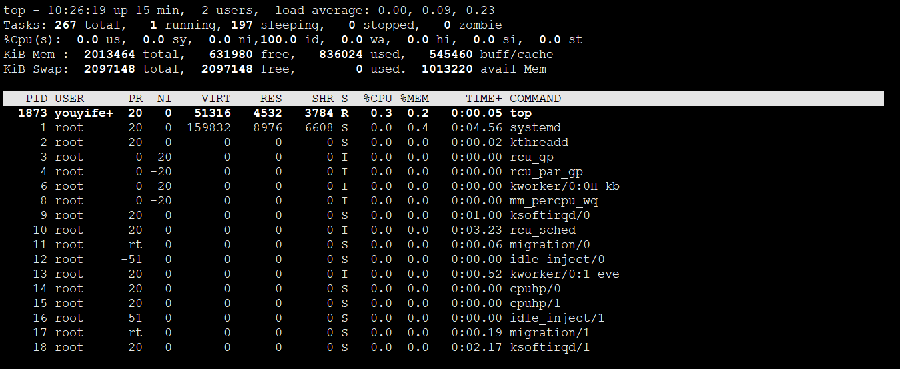

## file命令

* 显示文件类别

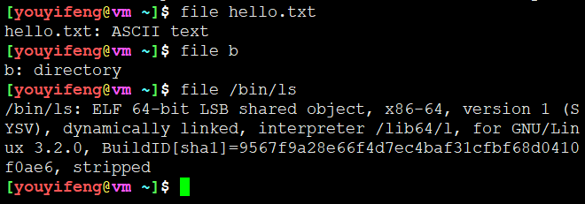


---


---
