<!-- MDTOC maxdepth:6 firsth1:1 numbering:0 flatten:0 bullets:1 updateOnSave:1 -->

- [Ubuntu软件安装](#ubuntu软件安装)   
   - [Ubuntu应用商店安装软件](#ubuntu应用商店安装软件)   
   - [终端下使用apt命令安装(首选)](#终端下使用apt命令安装首选)   
      - [apt软件源修改](#apt软件源修改)   
      - [安装软件](#安装软件)   
   - [dpkg安装软件](#dpkg安装软件)   
   - [Ubuntu下桌面放置应用图标](#ubuntu下桌面放置应用图标)   
   - [源码安装](#源码安装)   

<!-- /MDTOC -->
# Ubuntu软件安装

## Ubuntu应用商店安装软件

* 强烈不建议使用Ubuntu应用商店
* 打开超级慢，因为要缓存很长时间。所有内容缓存完成才会显示，否则，你啥也看不到

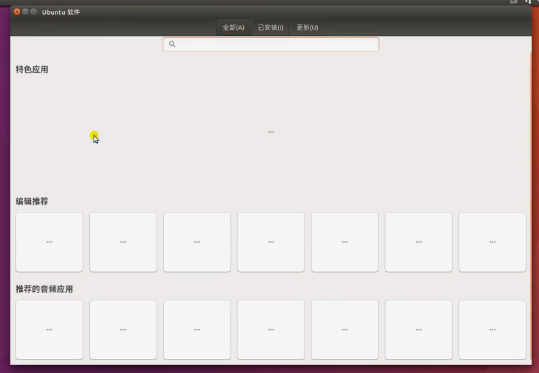

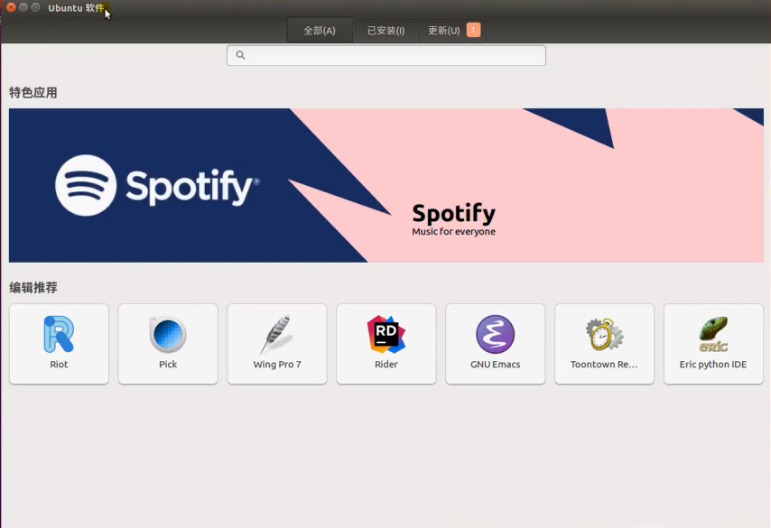

## 终端下使用apt命令安装(首选)

* sudo apt-get update : 更新软件源缓存
* sudo apt-get install -y PACKAGENAME PACKAGENAME ： 罗列需要安装的软件包,-y表示不需要提示确认
* sudo apt-get purge PACKAGENAME : 移除软件包并清除所有该软件包配置
* sudo apt-get remove PACKAGENAME : 移除软件包但是保留配置
* apt-cache search PACKAGENAME : 从缓存中查找软件包，**查找不需要sudo**
* dpkg -l ： 列出所有已安装软件


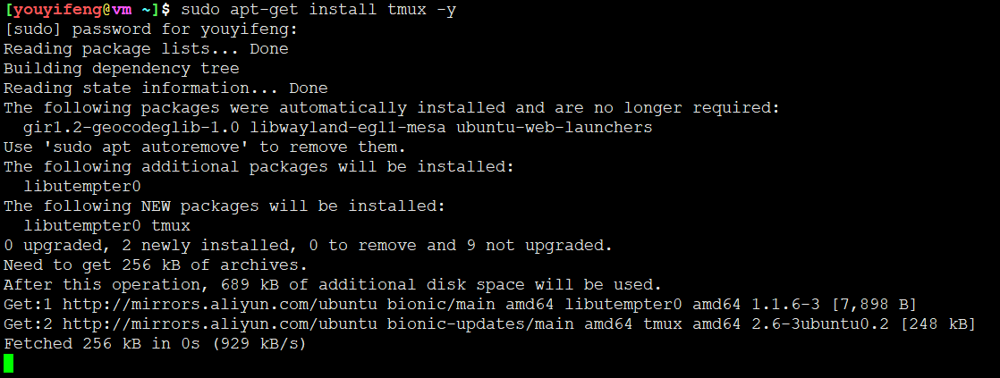

* 佐神视频里面的骚操作不容易碰到，```sudo apt-get install -f ```修复一下就是

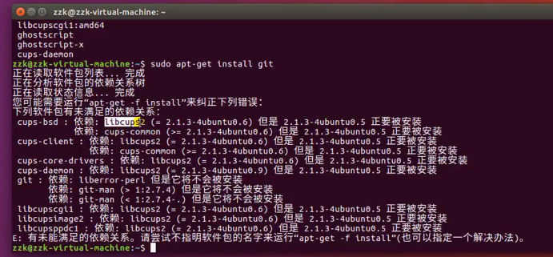

### apt软件源修改

```
vi /etc/apt/sources.list
```

添加如下内容：

```
deb http://mirrors.aliyun.com/ubuntu/ bionic main restricted
deb http://mirrors.aliyun.com/ubuntu/ bionic-updates main restricted
deb http://mirrors.aliyun.com/ubuntu/ bionic universe
deb http://mirrors.aliyun.com/ubuntu/ bionic-updates universe
deb http://mirrors.aliyun.com/ubuntu/ bionic multiverse
deb http://mirrors.aliyun.com/ubuntu/ bionic-updates multiverse
deb http://mirrors.aliyun.com/ubuntu/ bionic-backports main restricted universe multiverse
```

### 安装软件

* 有些命令不能存在会给出智能提示，教你如何安装

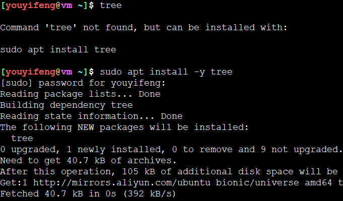

## dpkg安装软件

* dpkg无法解决依赖
* dpkg安装需要提前准备好deb软件包

* dpkg -i PACKAGE.deb  : 安装deb包，不会安装依赖
* dpkg -e PACKAGE ： 删除deb包。不会删除依赖

## Ubuntu下桌面放置应用图标

* 应用都在/usr/share/applications下
* 拷贝/usr/share/applications/下对应的软件.desktop 到 ~/Desktop目录下，就放到桌面了
* ~/Desktop目录下所有可见内容都会显示在桌面上

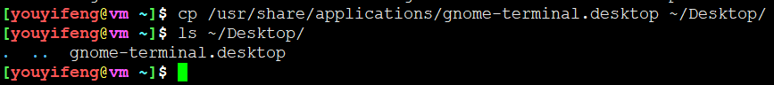


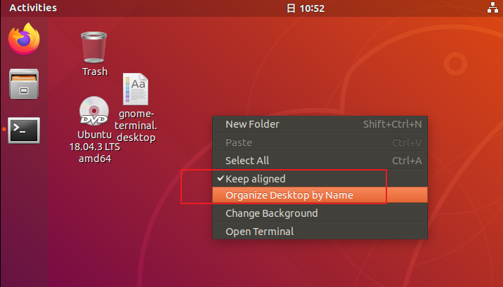

自动对齐一下

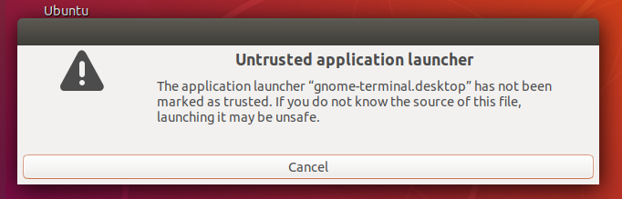

不授信，还需要授权

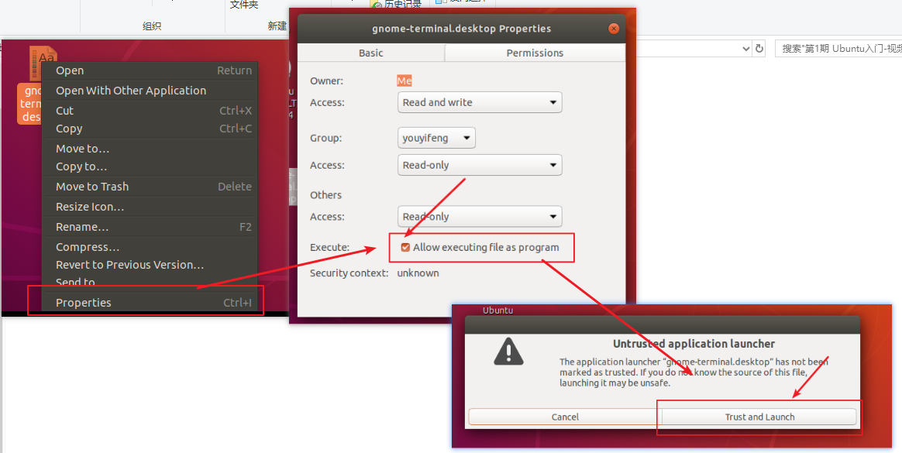

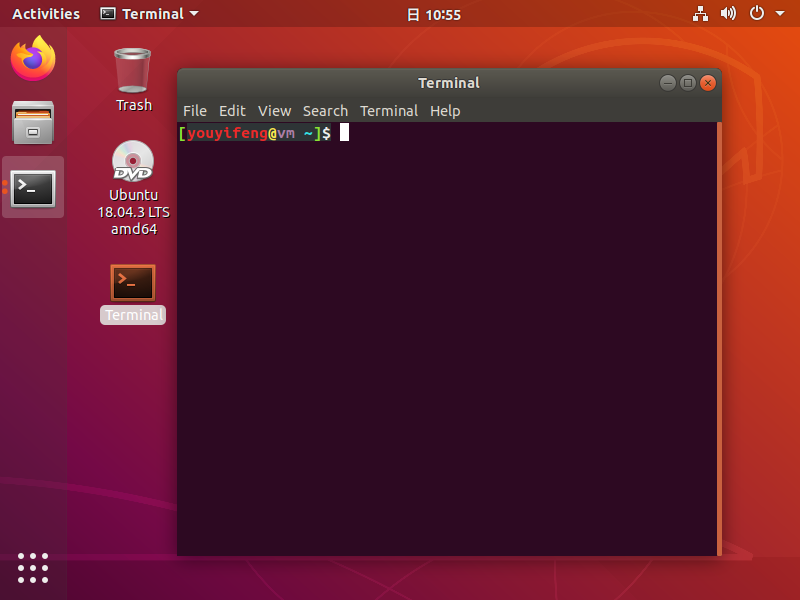

这一套操作下来也是麻烦的一匹。估计有命令直接完成。本质不还是酱紫么~~~

* 佐神虚拟机没有开硬件虚拟化加持，所以卡的一批~~菜的抠脚

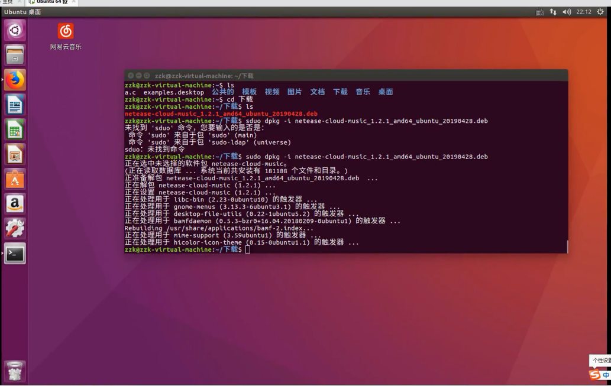


## 源码安装

* 下载源码，配置源码，编译源码，安装源码

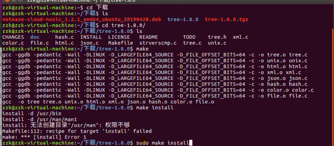


---
