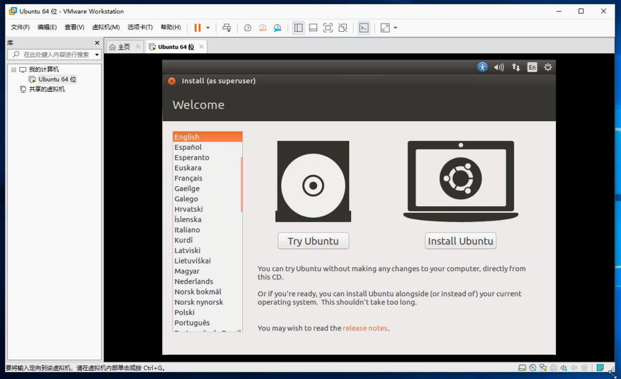
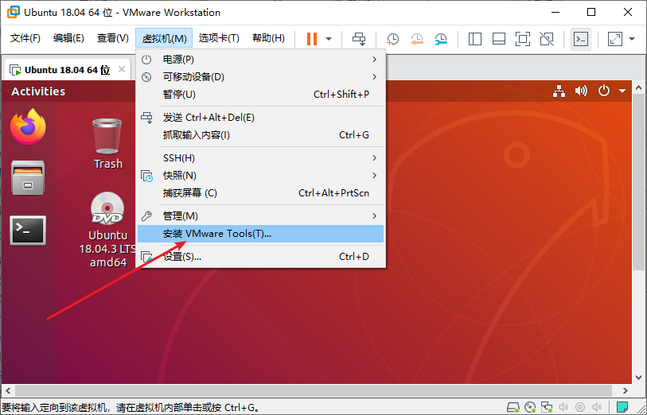
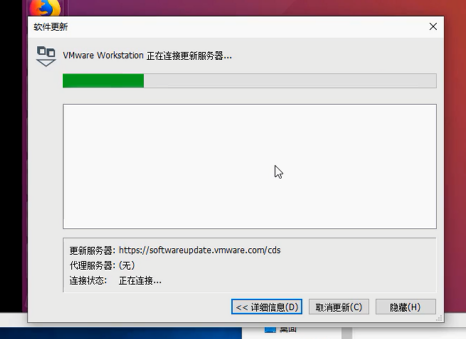
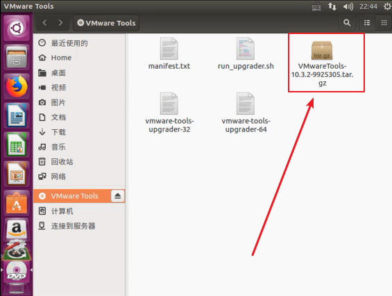
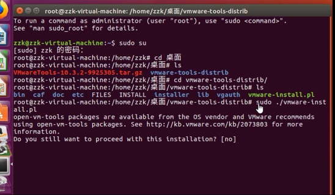
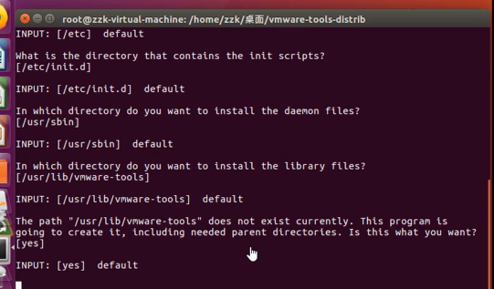
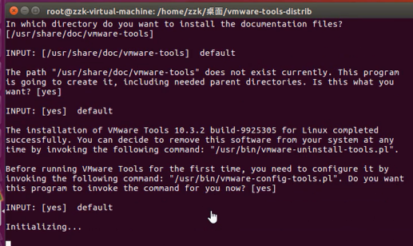
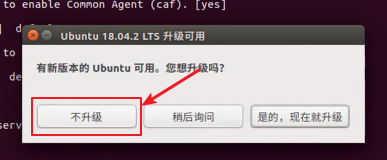
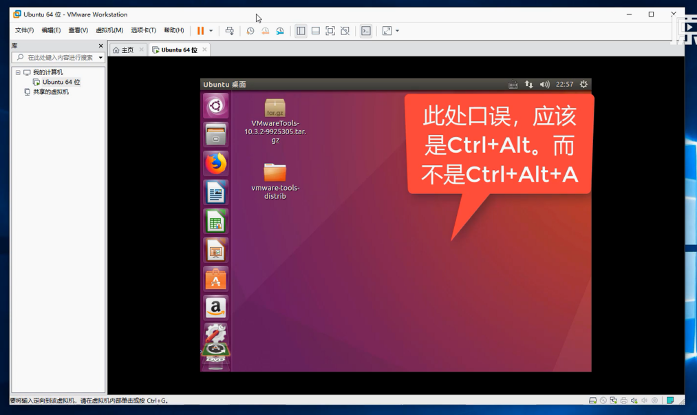
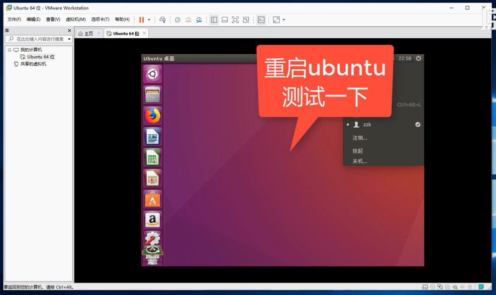

# VMware安装Ubuntu系统

## Ubuntu 18.04系统镜像下载

* <https://ubuntu.com/#download>
* 选择LTS 长期支持 版本

* 建议使用IDM神器下载，具体软件获取请移步吾爱破解自行搜索

## 虚拟机配置光盘镜像

## 启动虚拟机进入安装界面

* 佐神教程里都说的安装 Ubuntu16 LTS 版本，建议用 Ubuntu 18.04 bionic LTS
* 这年头Ubuntu 20 LTS都已经出来了

* 强烈建议安装英文版，不要安装中文

* 这个操作，其实有那么一丢丢用处，只要有连接网络，安装过程中还是会有网络连接产生
* 此问题Ubuntu多年不休的Bug，意欲何为？
* 最好的办法是在安装过程中断开网络连接

* 学Ubuntu还是。。不要用中文输入法了，纯英文就行

* 主机名，用户名不易过长
* 佐神pdf里面用的zuozhongkai，视频教程利用的zzk，你懂的~~
* 强烈建议勾选自动登录。。除非你要在这个虚拟机里面放一个亿，否则后面将会节约你不少生命

善后工作

1. 取消启动时连接光盘

## 安装VMware Tools工具

* 佐神这块内容视频讲的，怎么说呢，没有预习，不够专业，浪费观众生命呃。。。
* 开启虚拟机，菜单栏，虚拟机 -》 安装 VMware Tools
* 肯定要开机才能安装。。佐神对这块不了解呢，虚拟机用的少呃。。

* 虚拟机更新是完全没有必要的

* Ubuntu下安装VMware Tools本质是，插入了一个光盘镜像，然后需要你自己手动在Ubuntu下打开光盘进行，解压进行安装
* Windows下安装VMware Tools就很简单，跟Windows软件安装一样，下一步下一步。不过也是一插入光盘形式，只不过会自动触发启动安装界

* 解压VMware Tools工具，sudo执行
* 默认一路回车，回车就是yes

* 有升级提示框，建议不升级

* 退出 VMware窗口，按Ctrl+Alt就可以了

* VMware Tools安装完成一定要重启才能生效

 

---
