# VMware安装Ubuntu系统

## Ubuntu 18.04系统镜像下载

* <https://ubuntu.com/#download>

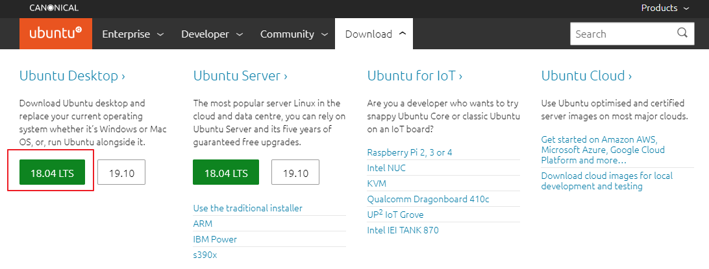

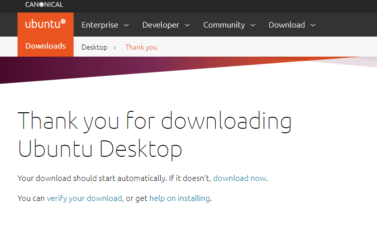

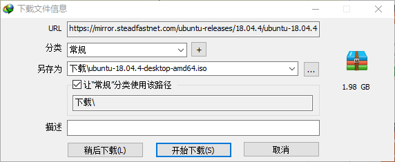

* 建议使用IDM神器下载，具体软件获取请移步吾爱破解自行搜索

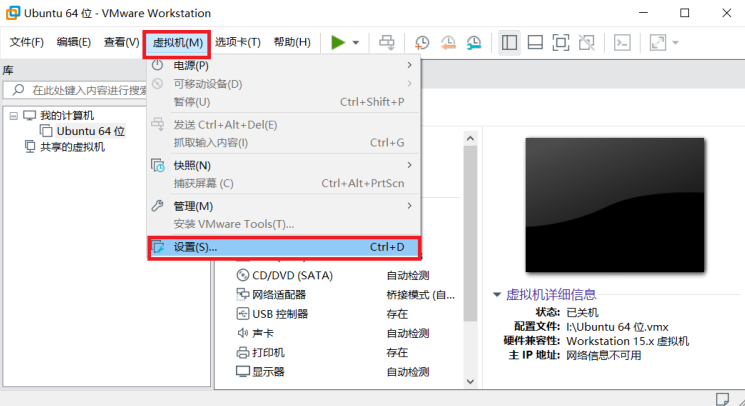

## 虚拟机配置光盘镜像

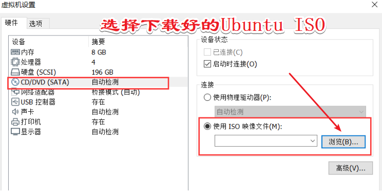

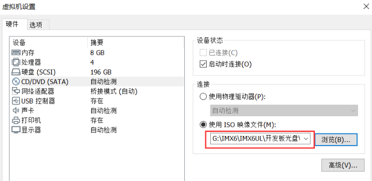

## 启动虚拟机进入安装界面

* 佐神教程里都说的安装 Ubuntu16 LTS 版本，建议用 Ubuntu 18.04 bionic LTS
* 这年头Ubuntu 20 LTS都已经出来了

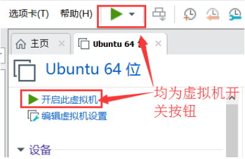

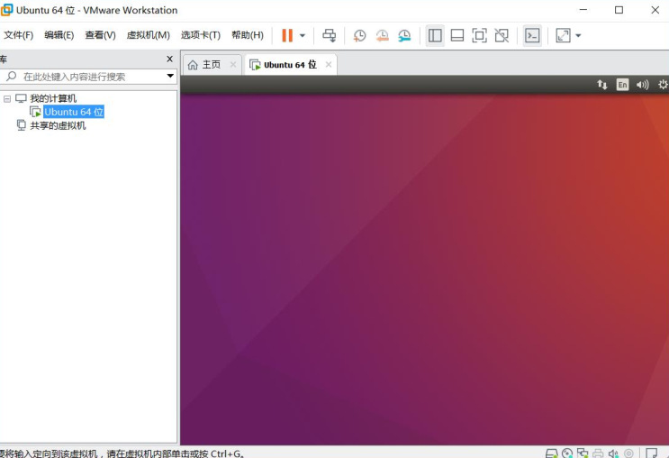

* 强烈建议安装英文版，不要安装中文

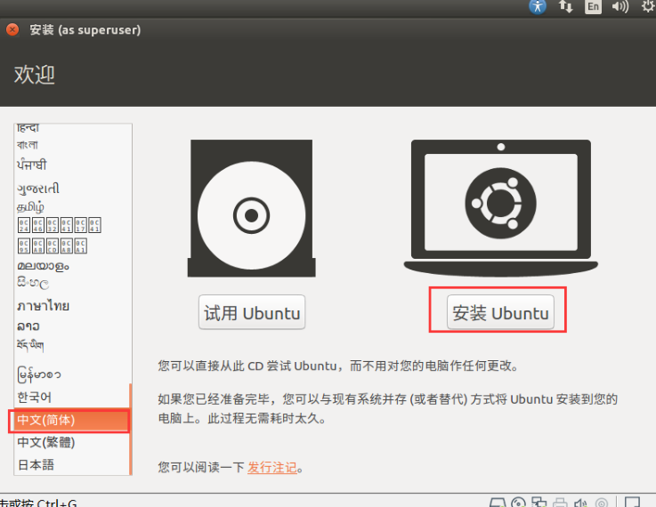

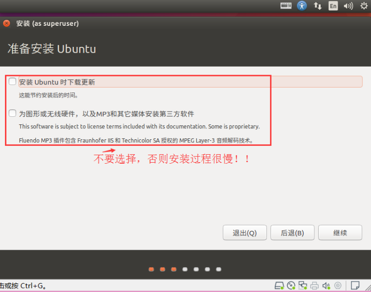

* 这个操作，其实有那么一丢丢用处，只要有连接网络，安装过程中还是会有网络连接产生
* 此问题Ubuntu多年不休的Bug，意欲何为？
* 最好的办法是在安装过程中断开网络连接

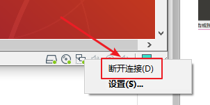

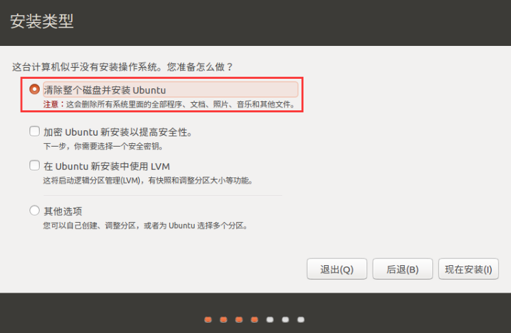

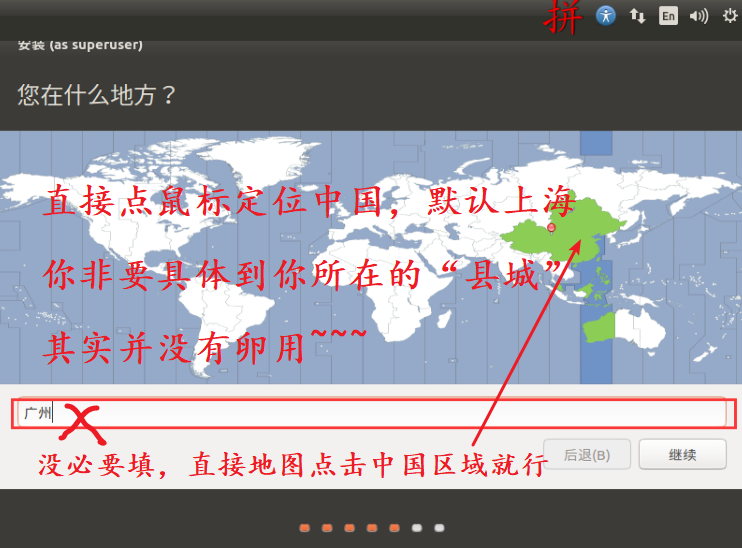

* 学Ubuntu还是。。不要用中文输入法了，纯英文就行

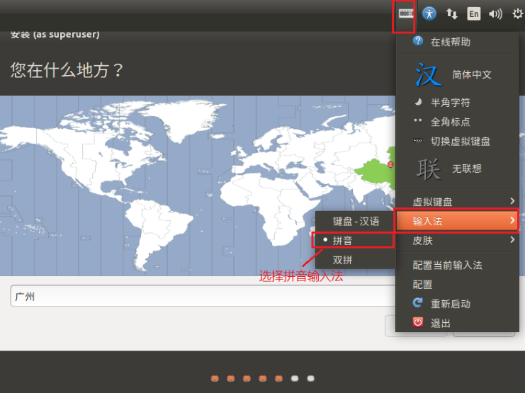

* 主机名，用户名不易过长
* 佐神pdf里面用的zuozhongkai，视频教程利用的zzk，你懂的~~
* 强烈建议勾选自动登录。。除非你要在这个虚拟机里面放一个亿，否则后面将会节约你不少生命

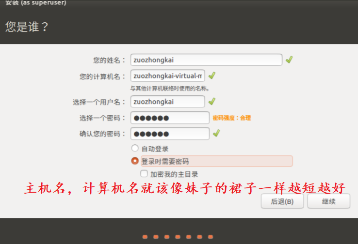

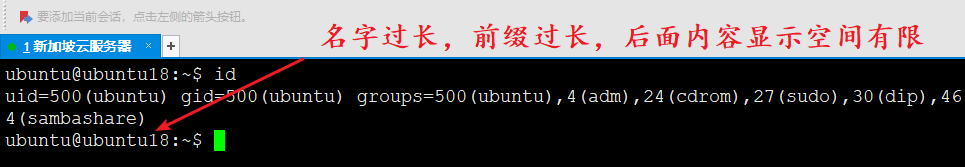

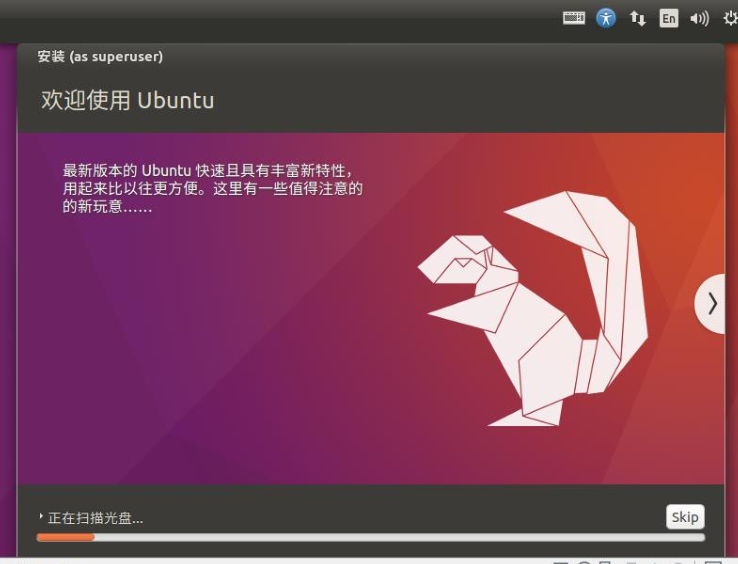

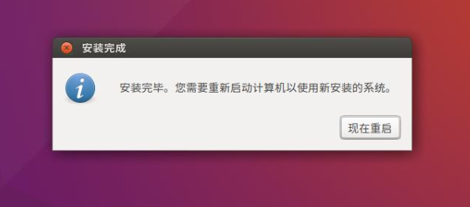

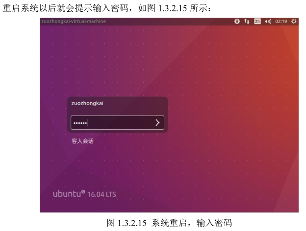

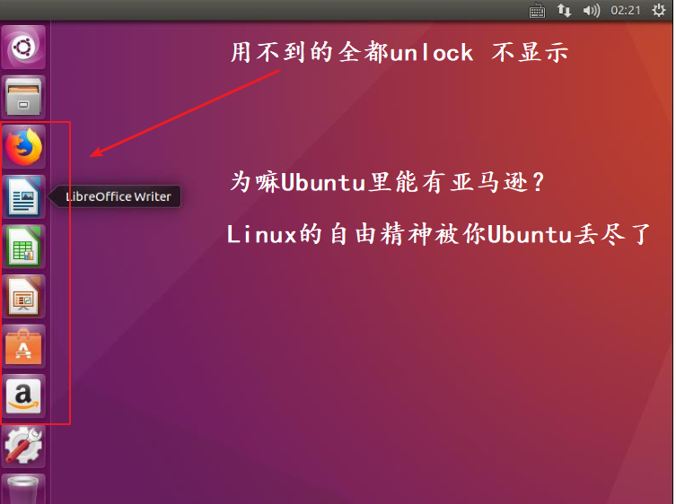

善后工作

1. 取消启动时连接光盘

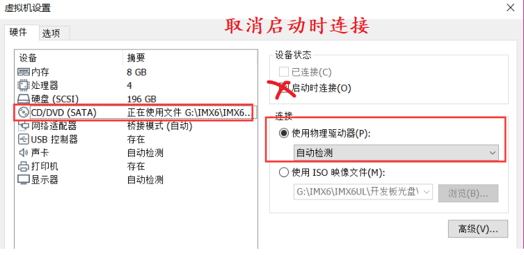

---
