<!-- MDTOC maxdepth:6 firsth1:1 numbering:0 flatten:0 bullets:1 updateOnSave:1 -->

- [shell脚本入门](#shell脚本入门)   
   - [shell脚本写法](#shell脚本写法)   
   - [交互式shell脚本](#交互式shell脚本)   
   - [shell中数值计算](#shell中数值计算)   
   - [test命令](#test命令)   
   - [中括号[]](#中括号)   
   - [shell中的默认变量](#shell中的默认变量)   
   - [shell中的()、[]、[[]]](#shell中的、、)   
   - [参考](#参考)   

<!-- /MDTOC -->
# shell脚本入门

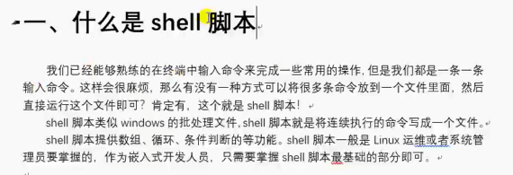

## shell脚本写法

```
#!/bin/bash

...

function fun1(){

}
```

* 第一行指定脚本解析器
* 脚本必须有可执行权限


## 交互式shell脚本

* read命令 ，其实用的很少


## shell中数值计算

* VAR=$(())
* 等号两边不能有任何空格
* 如果输入非数值，则视作0.若有一个数值则为该数值

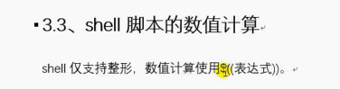  

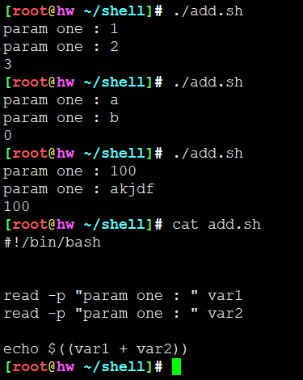


## test命令

* test命令基本相当于[]

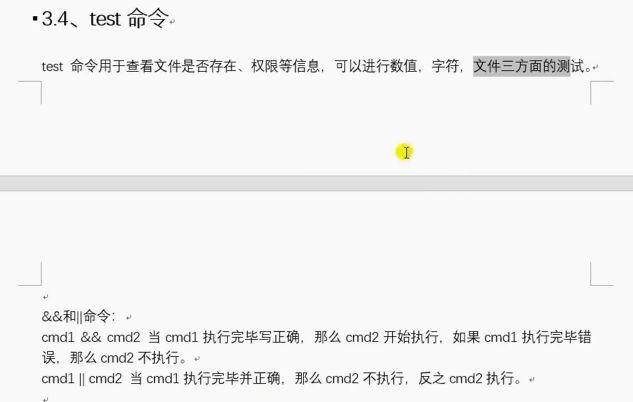

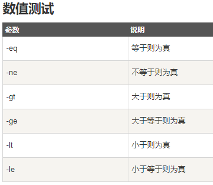

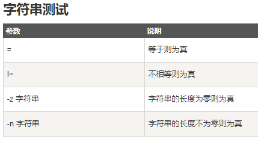

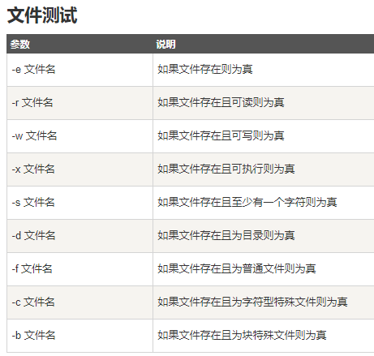

* 使用 && ||代替 if else

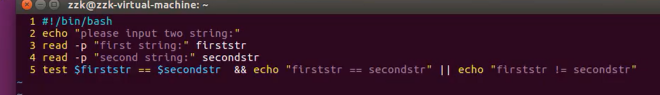

```
#!/bin/bash

[ $# != 0 ] && echo "have param" || echo "no param"
```

## 中括号[]

* == !=
* 变量一定要两侧引号


## shell中的默认变量

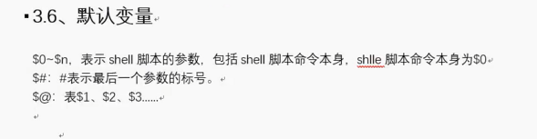

* $* 和 $@


## shell中的()、[]、[[]]

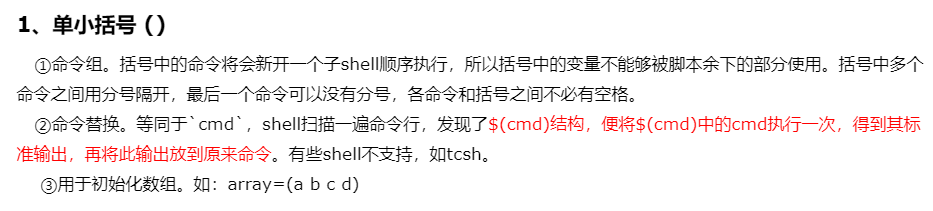

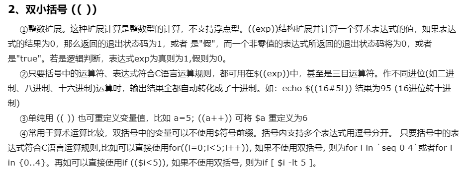

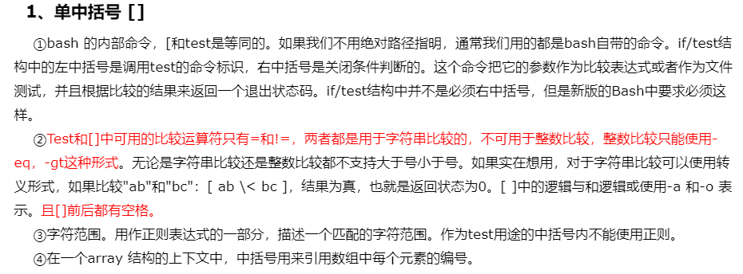

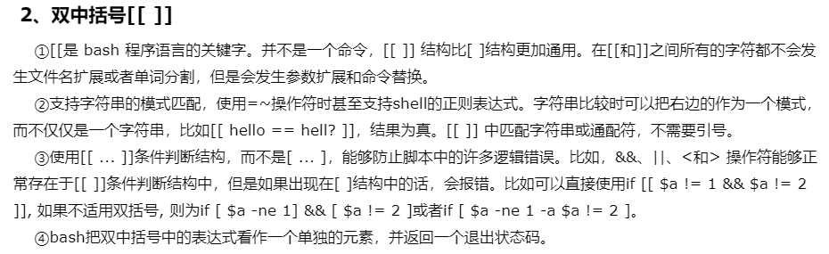

## 参考

* <https://www.cnblogs.com/qlqwjy/p/8684630.html>

---
