# shell脚本条件判断+函数+循环

## if+else

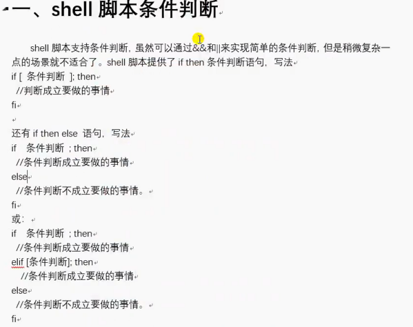

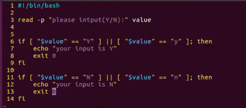

```
if [] || [] ;then
  ...
else
  ...
fi
```

```
if [] && [] ;then
  ...
else
  ...
fi
```

```
if [] && [] ;then
  ...
elif [] || [] ;then
  ...
else
  ...
fi
```

```
if [] && [] ;then
  ...
elif [] || [] ;then
  ...
elif  [] && [] ;then
  ...
else
  ...
fi
```


## case

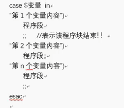

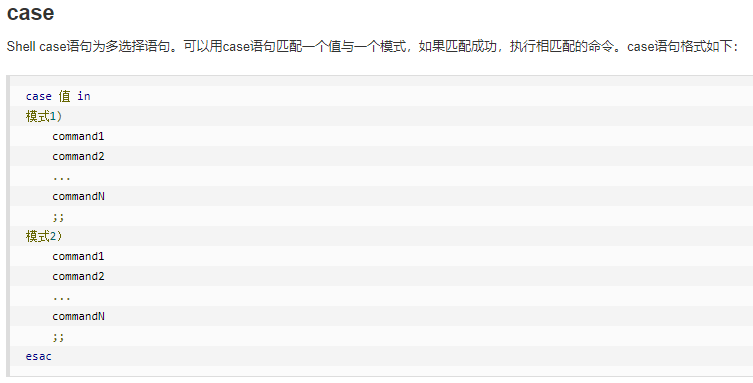

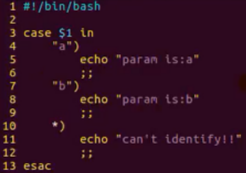


## shell脚本函数

```
function fun(){

}
```

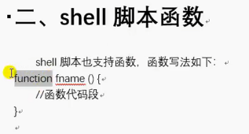


* shell 传参也是$1 $2


## while循环

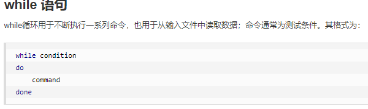


## for循环

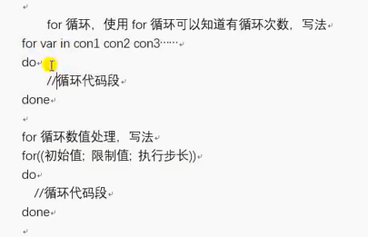

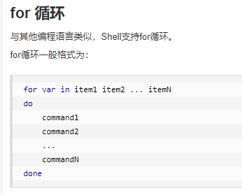

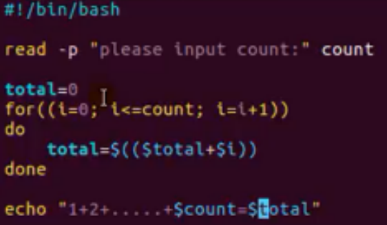

* 计算相关都要$(())


## until循环

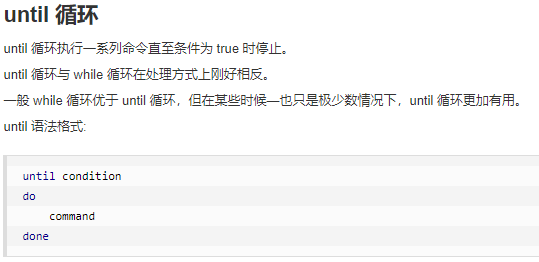

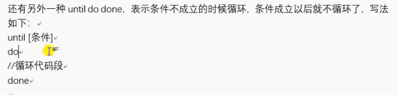


---
