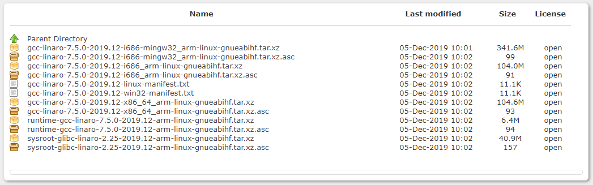
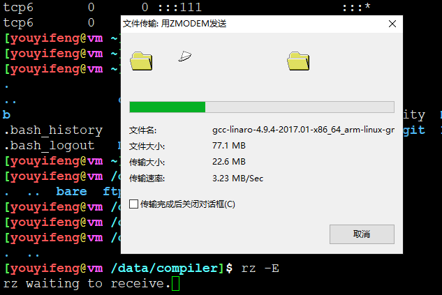
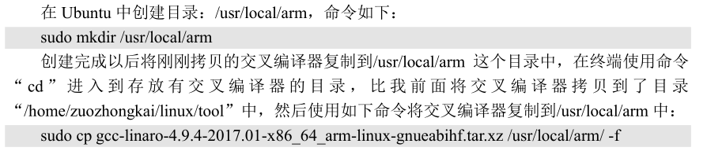
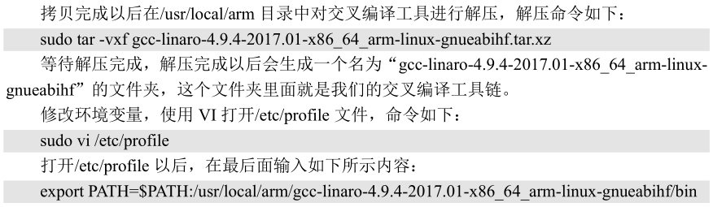
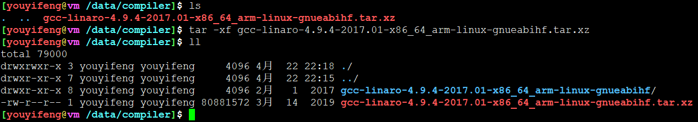
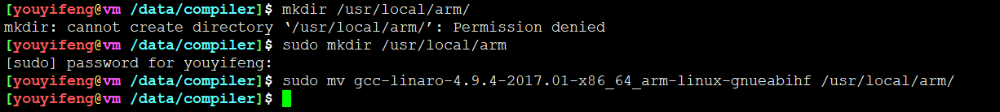
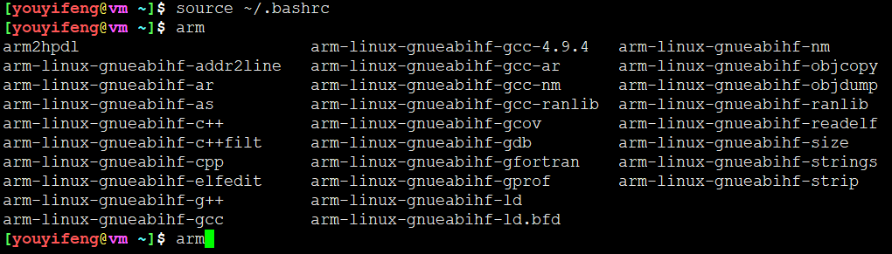
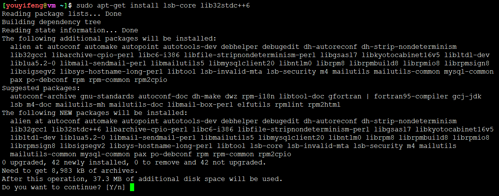
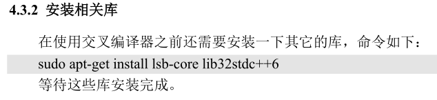

# 交叉编译器的安装

## 配置交叉编译器

官方链接：

```
https://releases.linaro.org/components/toolchain/binaries/latest-7/arm-linux-gnueabihf/
```



不需要下载，直接从官方光盘中获取

```
开发板光盘A-基础资料V1.3\5、开发工具\1、交叉编译器
```













```
cat >> ~/.bashrc << EOF
export PATH=$PATH:/usr/local/arm/gcc-linaro-4.9.4-2017.01-x86_64_arm-linux-gnueabihf/bin
EOF
```

修改后

```
source· ~/.bashrc
```



如果要改成系统环境变量，则修改/etc/profile

```
sudo su
cat >> /etc/profile << EOF
export PATH=$PATH:/usr/local/arm/gcc-linaro-4.9.4-2017.01-x86_64_arm-linux-gnueabihf/bin
EOF
```

## 安装依赖库





```
sudo apt-get install lsb-core lib32stdc++6
```

```
[youyifeng@vm ~]$ arm-linux-gnueabihf-gcc -v
Using built-in specs.
COLLECT_GCC=arm-linux-gnueabihf-gcc
COLLECT_LTO_WRAPPER=/usr/local/arm/gcc-linaro-4.9.4-2017.01-x86_64_arm-linux-gnueabihf/bin/../libexec/gcc/arm-linux-gnueabihf/4.9.4/lto-wrapper
Target: arm-linux-gnueabihf
Configured with: /home/tcwg-buildslave/workspace/tcwg-make-release/label/docker-trusty-amd64-tcwg-build/target/arm-linux-gnueabihf/snapshots/gcc-linaro-4.9-2017.01/configure SHELL=/bin/bash --with-mpc=/home/tcwg-buildslave/workspace/tcwg-make-release/label/docker-trusty-amd64-tcwg-build/target/arm-linux-gnueabihf/_build/builds/destdir/x86_64-unknown-linux-gnu --with-mpfr=/home/tcwg-buildslave/workspace/tcwg-make-release/label/docker-trusty-amd64-tcwg-build/target/arm-linux-gnueabihf/_build/builds/destdir/x86_64-unknown-linux-gnu --with-gmp=/home/tcwg-buildslave/workspace/tcwg-make-release/label/docker-trusty-amd64-tcwg-build/target/arm-linux-gnueabihf/_build/builds/destdir/x86_64-unknown-linux-gnu --with-gnu-as --with-gnu-ld --disable-libmudflap --enable-lto --enable-objc-gc --enable-shared --without-included-gettext --enable-nls --disable-sjlj-exceptions --enable-gnu-unique-object --enable-linker-build-id --disable-libstdcxx-pch --enable-c99 --enable-clocale=gnu --enable-libstdcxx-debug --enable-long-long --with-cloog=no --with-ppl=no --with-isl=no --disable-multilib --with-float=hard --with-mode=thumb --with-tune=cortex-a9 --with-arch=armv7-a --with-fpu=vfpv3-d16 --enable-threads=posix --enable-multiarch --enable-libstdcxx-time=yes --with-build-sysroot=/home/tcwg-buildslave/workspace/tcwg-make-release/label/docker-trusty-amd64-tcwg-build/target/arm-linux-gnueabihf/_build/sysroots/arm-linux-gnueabihf --with-sysroot=/home/tcwg-buildslave/workspace/tcwg-make-release/label/docker-trusty-amd64-tcwg-build/target/arm-linux-gnueabihf/_build/builds/destdir/x86_64-unknown-linux-gnu/arm-linux-gnueabihf/libc --enable-checking=release --disable-bootstrap --enable-languages=c,c++,fortran,lto --build=x86_64-unknown-linux-gnu --host=x86_64-unknown-linux-gnu --target=arm-linux-gnueabihf --prefix=/home/tcwg-buildslave/workspace/tcwg-make-release/label/docker-trusty-amd64-tcwg-build/target/arm-linux-gnueabihf/_build/builds/destdir/x86_64-unknown-linux-gnu
Thread model: posix
gcc version 4.9.4 (Linaro GCC 4.9-2017.01)
```
