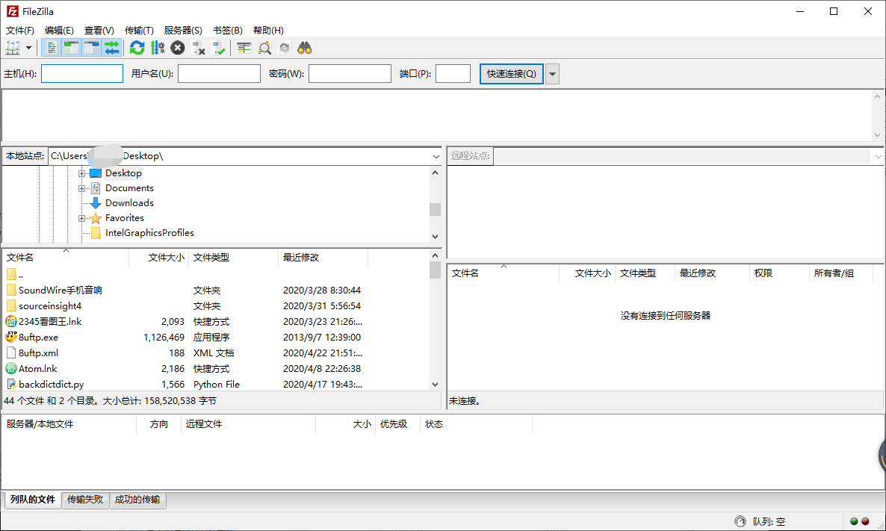
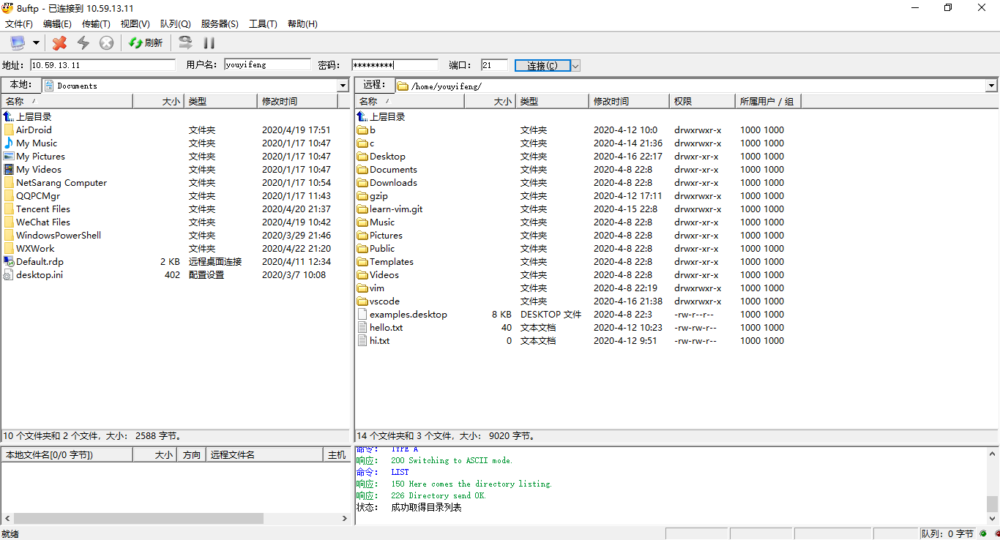
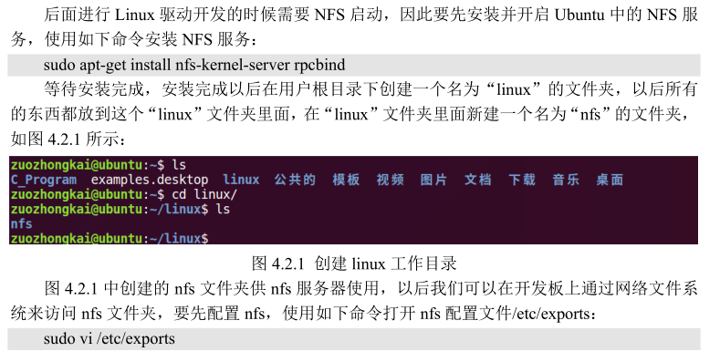
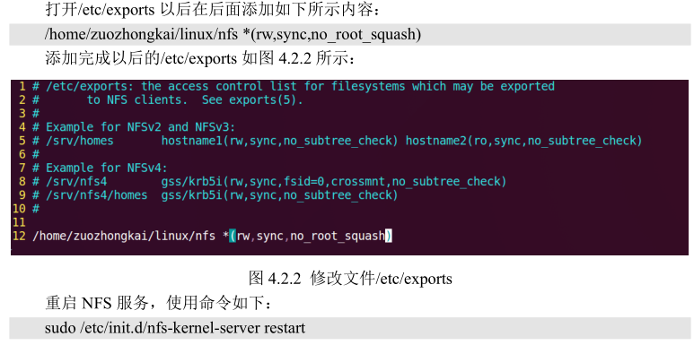
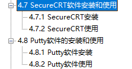

# 开发环境搭建

## 开发软件安装

### Ubuntu和Windowws文件互传

1. lrzsz传输
2. winscp传输

严禁使用虚拟机工具

### ftp服务安装


```
sudo apt-get install vsftpd
```

### ftp客户端

ftp客户端多如牛毛，凭什么用FileZilla。



辣鸡FileZilla，还不如 8uftp.exe 来的方便



### NFS安装





```
/data/nfs  *(rw,sync,no_root_squash)
```

## sshd服务

```
sudo apt-get install openssh-server -y
```



* SecureCRT 和 putty 都辣鸡，不要用


* 推荐mobaxterm和xshell


---
